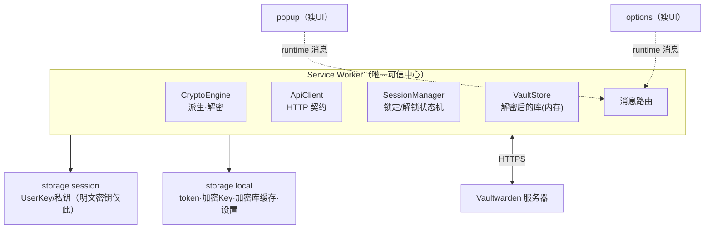
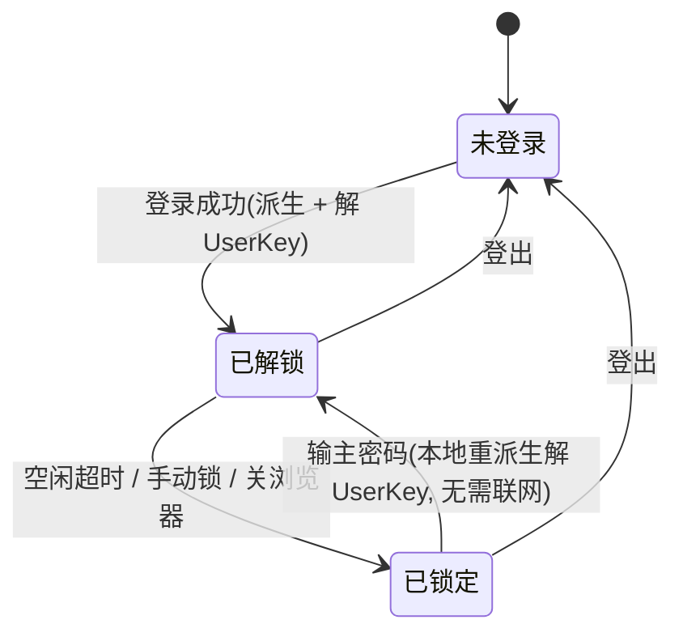
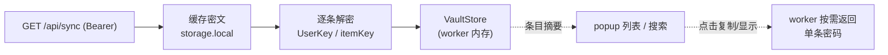
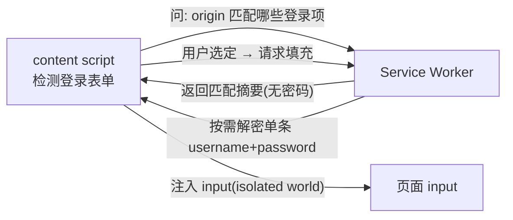

# Vaultwarden 浏览器扩展 — M1–M3 设计（地基 + 只读查看）

> 状态：已通过 brainstorming 评审，待用户最终确认后进入 writing-plans。
> 日期：2026-06-27
> 范围：M1（地基/加密内核）+ M2（认证与会话）+ M3（同步与只读查看）。

## 1. 背景与目标

构建一个**原生（无框架）的 Manifest V3 浏览器扩展**，作为自托管 Vaultwarden（Bitwarden 兼容）服务器的客户端。

- **技术栈**：Manifest V3 + WebExtensions API + TypeScript + Service Worker，**不使用任何前端/扩展框架**（无 React/Vue/Plasmo/WXT）。
- **核心架构**：**独立式**——扩展直连 Vaultwarden 服务器（HTTPS），自己完成全部零知识加密（密钥派生、解包 UserKey、解密 EncString），**严格遵循 Bitwarden 安全白皮书**。不依赖任何桌面应用。
- **目标平台**：Chrome / Edge（同为 Chromium，一套代码）优先；代码架构为 Safari / Firefox 预留，后续里程碑再扩展。
- **工具链与依赖**：一律采用**最新稳定版**（TypeScript、esbuild、vitest、webextension-polyfill、`@types/*`、Node LTS）。

### 1.1 参考资料（事实来源）

- `D:\Code\WinVaultWarden\docs\API.md` — Vaultwarden/Bitwarden 兼容 API 完整契约。
- `D:\Code\WinVaultWarden\docs\vaultwarden-api-contracts.md` — 登录主线 + 加密模型（逐行精读源码确认）。
- Bitwarden Security White Paper（密钥派生链、零知识模型、AES-256-CBC + HMAC、保护性对称密钥）。

> **字段大小写严格照抄契约源码**（登录响应 PascalCase、sync 响应 camelCase 同源不同壳），不可擅自统一。

## 2. 里程碑全景（路线图）

完整产品愿景拆为 8 个相对独立、各自可端到端交付与测试的里程碑。**本 spec 仅覆盖 M1–M3。**

| 里程碑 | 内容 | 本 spec |
|---|---|:---:|
| **M1 地基** | 构建管线 + 项目骨架 + 加密内核（PBKDF2，含官方测试向量）+ 安全存储 | ✅ |
| **M2 认证与会话** | prelogin/登录/2FA/刷新 + 锁定/解锁状态机 | ✅ |
| **M3 同步与查看** | GET /sync + 全量解密 + popup 列表/搜索/复制 | ✅ |
| M4 自动填充 | content script + 表单识别 + 填充 + 保存提示 | ⏭️ 后续 |
| M5 增删改 + 密码生成器 | ciphers/folders CRUD + 生成器 | ⏭️ 后续 |
| M6 TOTP | 验证码生成 + 显示/填充 | ⏭️ 后续 |
| M7 passkeys | WebAuthn 独立签名（fido2Credentials 私钥）| ⏭️ 后续 |
| M8 Sends | 分享 CRUD + 加密 | ⏭️ 后续 |
| 注册 | 客户端账户密钥生成 + register 端点 | ⏭️ 后续 |
| Argon2id | 引入 WASM KDF | ⏭️ 后续 |

**M1–M3 合起来 = 一个能登录解锁、同步解密、查看搜索的只读扩展**，也是第一个能客观验证白皮书加密正确性的交付物。

## 3. 关键设计决策（汇总）

| # | 主题 | 决策 |
|---|---|---|
| D1 | 核心架构 | 独立式，直连服务器，客户端零知识加密，遵循白皮书，不依赖桌面应用 |
| D2 | 目标平台 | Chrome/Edge 优先，架构为 Safari/Firefox 预留 |
| D3 | 范围与节奏 | 8 里程碑；本 spec 聚焦 M1–M3（地基 + 只读查看）|
| D4 | 会话/解锁模型 | 方案 B：UserKey 存 `storage.session`（内存级），worker 重启从其恢复；`chrome.alarms` 做空闲超时锁定 + 关浏览器即锁 |
| D5 | KDF 范围 | MVP 仅 PBKDF2-HMAC-SHA256（纯 WebCrypto，零加密依赖）；`kdf=1` 友好提示；Argon2id 后续 |
| D6 | 注册 | 后移；M1–M3 仅登录已有账户 |
| D7 | 架构组织 | 方案 1：中心化后台 worker 持有所有敏感逻辑与状态，popup/options 为瘦 UI |
| D8 | 浏览器 API 层 | `webextension-polyfill`（`browser.*`），`platform/` 仅封装业务约定 |
| D9 | 构建 | esbuild（~30 行脚本），三入口分别打包到 `dist/` |
| D10 | host 权限 | `optional_host_permissions`，用户配置服务器 URL 后运行时动态申请 |

## 4. 架构总览

MV3 有三个执行上下文。采用**中心化后台 worker**：所有敏感逻辑集中在 service worker，UI 瘦客户端化，经 `runtime` 消息通信。



**为什么是它**：MV3 中 popup 一关即销毁、无法托管状态；只有 worker 能借 `storage.session` 跨重启维持"解锁态 + 密码库"。单一可信中心也让安全边界清晰、密钥生命周期可控。

## 5. 项目结构与构建管线（M1 骨架）

```
src/
├─ background/index.ts          # service worker 入口 + 消息路由
├─ core/                        # 纯 TS，零 chrome.* 依赖，可在 Node 下单测
│  ├─ crypto/
│  │  ├─ primitives.ts          # WebCrypto 薄封装(pbkdf2/hkdfExpand/aesCbc/hmac/rsaOaep)
│  │  ├─ kdf.ts                 # MasterKey / MasterPasswordHash / stretchMasterKey
│  │  ├─ encstring.ts           # EncString 解析 + 解密(含 Encrypt-then-MAC 验证)
│  │  └─ keys.ts                # 解 UserKey / RSA 私钥 / item key
│  ├─ api/
│  │  ├─ client.ts              # ApiClient（prelogin/token/refresh/sync）
│  │  └─ types.ts               # 契约类型，大小写照抄源码
│  ├─ vault/
│  │  ├─ models.ts              # DecryptedCipher 等内存模型
│  │  └─ decrypt.ts             # 整库/单条解密
│  └─ session/
│     └─ session-manager.ts     # 状态机（未登录/已锁定/已解锁）
├─ platform/
│  ├─ storage.ts                # storage.local / session 业务封装
│  └─ messaging.ts              # 消息收发封装
├─ messaging/protocol.ts        # worker↔UI 类型化消息协议
├─ ui/
│  ├─ popup/{popup.html, popup.ts, popup.css}
│  └─ options/{options.html, options.ts, options.css}
└─ manifest.json
test/
└─ vectors/                     # 官方/可复现加密测试向量
build.mjs  tsconfig.json  package.json  dist/
```

- **分层原则**：`core/` 为纯函数、不碰浏览器 API，可在 Node 下单测（加密向量、解密、契约解析）。`platform/` 隔离浏览器差异，为 Safari/Firefox 预留。
- **构建（esbuild）**：把 `background`、`popup`、`options` 三个入口各打成 bundle 到 `dist/`，并复制 `manifest.json`、html、css、icons。npm scripts：`build` / `watch` / `test` / `typecheck` / `lint` / `zip`。
- **浏览器 API 层**：`webextension-polyfill`（`browser.*`，Promise 风格、极小、跨端标准）。`platform/` 只封装"存哪个 storage 区、消息语义"等业务约定。
- **manifest.json（MV3）权限**：
  - `permissions`: `storage`、`alarms`。
  - **不声明** `content_scripts`（M1–M3 无自动填充）。
  - `optional_host_permissions`: 用户在 options 填好 Vaultwarden URL 后，运行时动态申请该来源权限（自托管地址编译期未知，权限最小化）。
  - `action.default_popup = ui/popup/popup.html`。
  - `background.service_worker = background.js`，`type: module`。
  - `options_ui = ui/options/options.html`。

## 6. 加密内核（M1，安全核心）

严格遵循白皮书/契约源码的 **PBKDF2 派生链**：

| 步骤 | 计算 | WebCrypto |
|---|---|---|
| ① MasterKey | `PBKDF2-HMAC-SHA256(主密码, salt=email小写, iter=kdfIterations, 32B)` | `deriveBits` |
| ② MasterPasswordHash | `PBKDF2-HMAC-SHA256(MasterKey, salt=主密码, iter=1, 32B)` → base64 → 作为 `password` 发服务器 | `deriveBits` |
| ③ Stretched MasterKey | `HKDF-Expand(MasterKey,"enc",32) ‖ HKDF-Expand(MasterKey,"mac",32)` → 64B(32 enc + 32 mac) | 手写 HKDF-Expand + HMAC |
| ④ UserKey | 用 ③ 解 `Key`/akey（EncString encType=2）→ 64B(32 enc + 32 mac) | AES-CBC + HMAC |
| ⑤ RSA 私钥 | 用 ④ 解 `PrivateKey`（encType=2）→ PKCS#8 | AES-CBC + HMAC |
| ⑥ 条目字段 | 每个 EncString 用 UserKey（或条目自带 item key）解密 | AES-CBC + HMAC |

### 6.1 三个必须正确的易错点

1. **HKDF-Expand ≠ WebCrypto 的 HKDF**：Bitwarden 仅做 Expand（MasterKey 本身已是 PBKDF2 输出，无需 Extract），而 WebCrypto 的 `HKDF` 算法强制 Extract+Expand。**必须用 WebCrypto 的 HMAC 手写 RFC 5869 的 Expand 步骤**：对 `L=32, HashLen=32`，`N=1`，`OKM = HMAC(PRK, info ‖ 0x01)`，`info` 为 `"enc"`/`"mac"` 的 UTF-8 字节。
2. **Encrypt-then-MAC，先验证后解密**：encType=2 必须先校验 `HMAC-SHA256(macKey, iv ‖ ct)` 与 EncString 的 mac（**常数时间比较**），通过后才 AES-256-CBC 解密。校验失败即抛错。
3. **两处 salt 不同**：MasterKey 的 salt 是 **email**（小写）；MasterPasswordHash 的 salt 是**主密码明文**、迭代 **1** 次。

### 6.2 EncString 格式

- 对称：`encType.iv|ct|mac`，`encType=2` 即 `AesCbc256_HmacSha256_B64`（iv/ct/mac 均 base64）。
- RSA：`encType.data` 单段（如 `4` = `Rsa2048_OaepSha1_B64`）。

### 6.3 模块边界（`core/crypto/`）

全部纯函数、`Uint8Array`/`string` 进出、零 `chrome.*` 依赖，可单测：

- `primitives.ts`：`pbkdf2Sha256`、`hkdfExpand`、`aesCbcDecrypt`、`hmacSign`、`hmacVerify`、`rsaOaepDecrypt`。
- `kdf.ts`：`deriveMasterKey`、`deriveMasterPasswordHash`、`stretchMasterKey → {enc, mac}`。
- `encstring.ts`：`parse`、`decryptToBytes`（含 mac 验证）。
- `keys.ts`：`decryptUserKey`、`decryptPrivateKey`、`decryptItemKey`。

### 6.4 安全红线

- 主密码、MasterKey、UserKey **绝不落盘明文、不写日志、不离开扩展进程**。
- 唯一例外：UserKey/私钥按方案 B 存 `storage.session`（内存级、关浏览器即清）。
- 所有 mac 比较常数时间；解密失败不泄露细节。

### 6.5 已知边界（本阶段）

- 组织密钥需 RSA-OAEP 解 org key。M1–M3 聚焦**个人库**，组织/集合条目作为**已知限制延后**（仍解析其存在，但不解密组织密文）。

## 7. 认证与会话状态机（M2）

### 7.1 登录流程（worker 内）

1. popup 提交 email + 主密码（服务器 URL 已在 options 配好并完成 host 权限申请）。
2. `POST /identity/accounts/prelogin {email}` → 拿 `kdf`/`kdfIterations`。若 `kdf=1`(Argon2id) → 友好提示"MVP 暂不支持 Argon2id 账户"，终止。
3. 加密内核派生 MasterKey + MasterPasswordHash。
4. `POST /identity/connect/token`（`application/x-www-form-urlencoded`，password grant）：
   - `grant_type=password`、`username=email`、`password=MasterPasswordHash`、`scope=api offline_access`、`client_id=browser`、`device_type=2`(ChromeExtension)、`device_identifier`=扩展生成并存 local 的稳定 GUID、`device_name=chrome`。
   - **200** → 拿 `access_token`/`refresh_token`/`expires_in` + `Key` + `PrivateKey` + `Kdf*`。
   - **400** `invalid_grant` / "Two factor required" + `TwoFactorProviders` → 进入 2FA 流程。
5. 用 stretched MasterKey 解 `Key` 得 UserKey；用 UserKey 解 `PrivateKey` 得 RSA 私钥。
6. 建立解锁态（见 7.3）。

### 7.2 2FA 范围

- MVP 支持 **Authenticator(TOTP, type=0)** 与 **Email(type=1)**；含"记住此设备"（`two_factor_remember=1` → 保存返回的 `TwoFactorToken`，下次带上）。
- Email：按新版客户端约定主动调 `POST /api/two-factor/send-email-login` 触发发码。
- WebAuthn(7) / Duo(2) / YubiKey(3) **延后**。
- 流程：拿到验证码后**重发完整 password grant** 并带 `two_factor_provider` + `two_factor_token`。

### 7.3 锁定 ≠ 登出（核心模型）



- **已锁定**态保留 token + 加密的 `Key`/`PrivateKey` + 加密库缓存（全是密文），仅丢失内存中的 UserKey。解锁 = 重新输主密码 → 本地派生 → 解 `Key` → 得 UserKey，**无需重新联网**（除非 token 过期需刷新）。
- **空闲超时**用 `chrome.alarms` 周期检查最后活动时间（`setTimeout` 会随 worker 被杀失效）。
- **关浏览器即锁**靠 `storage.session` 天然清空。
- **默认锁定超时 15 分钟**；options 可选 1/5/15/30 分钟、关浏览器时、（不推荐）永不。
- **登出**：清除全部（session + local 中的 token/加密 Key/加密库/记住设备 token）。

### 7.4 令牌刷新

`access_token`（~1h）过期或请求遇 401 时，ApiClient 自动用 `refresh_token`（`grant_type=refresh_token`）刷新。refresh 失败（refresh_token 失效）→ 转为需重新登录（保留加密库缓存，要求重新输密码 + 联网）。

### 7.5 storage 划分（安全关键）

| 区 | 落盘? | 内容 |
|---|---|---|
| `storage.session` | 否（内存，关浏览器清）| **UserKey、解密后的 RSA 私钥（明文密钥仅存这里）** |
| `storage.local` | 是（持久）| 服务器 URL、device GUID、access/refresh token、**加密的** `Key`/`PrivateKey` + KDF 参数、**加密的**库缓存、锁定超时等设置、记住设备 `TwoFactorToken` |

`local` 中全是密文或不可解密库的凭证；明文密钥只在 `session`。

## 8. 同步与只读查看 UI（M3）

### 8.1 数据流



### 8.2 解密

- 对每个 cipher：若有 `cipher.key`（item key, EncString），先用 UserKey 解出 item key，字段用 item key 解；否则字段直接用 UserKey 解。
- 解密字段：`name`、`login.username`、`login.password`、`login.uris[]`、`login.totp`、`notes` 等（均 EncString encType=2）。
- `type`：Login=1 / SecureNote=2 / Card=3 / Identity=4 / SshKey=5。M3 全部展示 `name`，**重点 Login**。

### 8.3 缓存 + 敏感字段按需解密

- sync 密文缓存到 `storage.local`（加密态，快速启动/离线查看）。worker 被杀后用 `session.UserKey` + local 密文重建 VaultStore。
- **popup 列表只拿 name/username/uri 摘要；密码等敏感字段不随列表批量下发**。用户点"复制/显示密码"时才向 worker 请求该条单字段。
- 明文密码**绝不写 storage、不落 local**，即用即弃。

### 8.4 消息协议（`messaging/protocol.ts`）

类型安全 discriminated union（worker↔UI）：

- popup → worker：`getState`、`login(email,password,serverUrl?)`、`submitTwoFactor(provider,token,remember)`、`unlock(password)`、`lock`、`logout`、`sync`、`listItems(query?)`、`getField(cipherId,field)`。
- worker → popup：会话状态、条目摘要列表、单字段值、结构化错误。

### 8.5 popup UI（纯 TS + DOM，无框架）

按会话状态路由：

- **未登录** → 登录表单（email / 主密码 / 必要时 2FA 输入）。
- **已锁定** → 解锁界面（输主密码）。
- **已解锁** → 库列表：搜索框（按 name/username/uri 过滤）、条目列表（占位图标 + name + username）→ 详情（username、密码默认掩码可切换显示、uri、notes、复制按钮）、顶部"同步 / 锁定 / 登出"。
- **复制密码后自动清剪贴板**（默认 ~20s，可配）。

### 8.6 options 页

服务器 URL（含 host 权限申请）、锁定超时、剪贴板清除秒数。

### 8.7 本阶段取舍

- 网站图标用**通用占位图标**（真实 favicon 涉及额外网络/隐私，延后）。
- 组织/集合条目延后（需 RSA org key）。

## 9. 可扩展性 / 前瞻

### 9.1 M4 自动填充复用本设计

自动填充只是把"密码消费方"从 popup 换成 content script，worker 始终是唯一解密中心：



- 复用 M1–M3 已有的 `getField` 按需解密接口 + 中心化 worker + 类型化消息协议。M4 仅新增：`content_scripts` 声明、按 origin/uri 匹配查询、面向 content script 的填充通道。
- 安全：严格 origin/uri 匹配防钓鱼；content script 在 isolated world 注入；密码即用即弃。
- **M1–M3 的消息协议与 worker 接口需为此预留**（设计上已满足）。

### 9.2 跨端（Safari / Firefox）

- 通过 `webextension-polyfill` + `platform/` 适配层隔离差异，核心逻辑（`core/`）与平台无关。
- Safari：后续用 `safari-web-extension-converter` 把同一份 `dist/` 包装为 Xcode 工程；注意 `storage.session`、`optional_host_permissions` 等差异需届时验证。

## 10. 错误处理与边界

| 场景 | 处理 |
|---|---|
| 服务器不可达/超时 | 明确区分"连不上服务器"与"凭证错误" |
| 自签证书（自托管常见）| 扩展不绕过证书错误；提示用户先让浏览器信任该证书（**已知约束**）|
| 密码错（解锁时 `Key` 的 mac 不过）| 即"主密码错误"——这本身就是验证主密码的手段 |
| `kdf=1`(Argon2id) | 友好提示"MVP 暂不支持"，不崩溃 |
| access_token 过期 | 自动 refresh；refresh 失败 → 转需重新登录（保留加密缓存）|
| 单条 cipher 解密失败 | 跳过 + 标记"无法解密"，**不让整库崩溃** |
| worker 被杀后收到消息 | 从 session 恢复；无 UserKey → 返回 Locked 让 UI 路由到解锁 |
| 解锁失败次数 | 本地不限次（纯本地）；联网登录由服务器限流 |
| 服务器 URL 输入 | 规范化：补 `https://`、去尾斜杠、格式校验 |

安全：绝不记录主密码/密钥/解密内容；错误日志脱敏。

## 11. 测试策略

1. **单元（核心，vitest 跑 `core/`）**：
   - 加密内核用**官方可复现测试向量**：已知 `(email, password, kdf, iter)` → 期望 MasterKey、MasterPasswordHash(base64)；已知 EncString + key → 期望明文；HKDF-Expand 向量；RSA 私钥解包；mac 不匹配必须抛错。**这是白皮书合规的客观验证。**
   - EncString 解析边界（格式错误、不支持的 encType、mac 不匹配）。
   - 派生链端到端：固定输入复现 UserKey。
2. **集成（worker 逻辑）**：ApiClient 用 mock fetch 验证 prelogin/token/2FA/refresh/sync 的请求构造与**大小写敏感**响应解析；SessionManager 状态机转换（mock storage）。
3. **手动验收**：对真实自托管 Vaultwarden（docker 起一个）+ PBKDF2 测试账户，跑通 登录 →(2FA)→ sync → 列表 → 搜索 → 查看 → 复制 → 锁定 → 解锁 → 登出；核查 `local` 无明文密钥/密码、`session` 关浏览器后清空、`device_type/client_id` 被服务器接受。
4. **CI**：lint + typecheck + 单元/集成测试。

测试向量以官方实现产出为准、逐行核对。

## 12. 安全合规清单（白皮书）

- [ ] 派生链与白皮书一致（PBKDF2/MasterPasswordHash/HKDF-Expand/UserKey/RSA）。
- [ ] Encrypt-then-MAC：先验证 mac 再解密，常数时间比较。
- [ ] 明文主密码/MasterKey/UserKey 不落盘、不写日志、不出进程；仅 UserKey 存 `storage.session`。
- [ ] `local` 仅存密文或不可解密库的凭证。
- [ ] 关浏览器即锁、空闲超时锁定生效。
- [ ] 错误信息与日志脱敏。

## 13. 验收标准（M1–M3 完成定义）

1. 加密内核全部单元测试通过，含官方测试向量（MasterKey/MasterPasswordHash/EncString/HKDF-Expand）。
2. 能对真实 PBKDF2 账户完成：配置服务器 → 登录（含 Authenticator/Email 2FA）→ sync → 列表/搜索 → 查看条目 → 复制 username/password → 自动清剪贴板。
3. 锁定/解锁/登出与超时、关浏览器即锁均符合状态机；解锁无需重新联网。
4. 存储审计：`local` 无明文密钥/密码，`session` 关浏览器后清空。
5. `kdf=1`、网络错误、单条解密失败等边界给出正确处理，不崩溃。
6. 扩展可在 Chrome 与 Edge 加载运行；`core/` 与平台解耦，为 Safari/Firefox 预留。

## 14. 非目标（本阶段明确不做）

注册、Argon2id、自动填充、条目增删改、密码生成器、TOTP 验证码、passkeys、Sends、组织/集合解密、真实网站图标、多账户。
