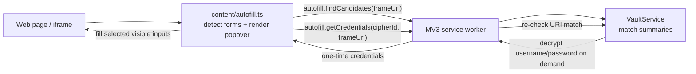

# Vaultwarden 浏览器扩展 M4 自动填充设计

## 1. 目标

M4 在 M1-M3 已完成的登录、同步、解密、只读查看基础上，增加原生 MV3 自动填充能力。目标体验接近主流密码管理器：页面检测到登录表单后显示半自动提示，用户选择匹配项后填入用户名和密码。

本阶段继续坚持 M1-M3 的安全边界：service worker 是唯一能访问解密 vault、UserKey 和按需解密字段的中心；content script 只负责 DOM 检测、浮层展示、用户选择和向当前表单写入一次性返回的凭据。

## 2. 范围

| 项目 | M4 处理方式 |
| --- | --- |
| 自动填充触发 | 半自动：检测表单后提示，用户点击候选项才填充 |
| 页面提示 | 表单旁 anchored popover，默认折叠为小的 Vaultwarden 触发按钮 |
| 权限 | 对 `http://*/*` 和 `https://*/*` 页面运行 content script |
| URI 匹配 | Bitwarden-like match type：Domain、Host、StartsWith、Exact、RegularExpression、Never |
| 默认匹配策略 | options 可配置，默认 Domain/Base Domain |
| iframe | 支持任意 iframe，按 frame 自己的 URL 独立匹配和填充 |
| 自动提交 | 不支持 |
| 保存新密码/更新密码提示 | 不支持，后续里程碑 |
| passkeys/TOTP/CRUD | 不属于 M4 |

## 3. 架构

M4 复用 M1-M3 的中心化后台架构，不让 content script 直接接触 vault cache 或密钥。



新增模块：

- `src/content/autofill.ts`：content script 入口。负责表单检测、浮层 UI、候选项请求、用户选择和字段填充。
- `src/core/vault/uri-match.ts`：Bitwarden-like URI 匹配纯函数。零浏览器依赖，必须有单测。
- `src/core/vault/domain.ts`：封装 `tldts` 做 public-suffix-aware base domain 解析，避免 `co.uk` 等复杂 TLD 误判。
- `src/core/vault/vault-service.ts`：新增 `findAutofillCandidates(frameUrl)` 和 `getAutofillCredentials(cipherId, frameUrl)`。
- `src/messaging/protocol.ts` / `src/background/router.ts`：新增 `autofill.*` typed messages。
- `src/ui/options/*`：新增默认 URI match strategy 设置。
- `src/manifest.json` / `build.mjs`：新增 content script 声明和 content 入口打包；manifest 使用 `matches: ["http://*/*", "https://*/*"]` 与 `all_frames: true`。

## 4. 数据模型

当前 M1-M3 的 `CipherSummary.uris: string[]` 只能搜索 URI 文本，不能表达 Bitwarden 的 match type。M4 需要保留 URI 与 match type：

```ts
export const UriMatchStrategy = {
  Domain: 0,
  Host: 1,
  StartsWith: 2,
  Exact: 3,
  RegularExpression: 4,
  Never: 5,
} as const;

export type UriMatchStrategySetting =
  (typeof UriMatchStrategy)[keyof typeof UriMatchStrategy];

export interface LoginUri {
  uri: string;
  match?: UriMatchStrategySetting;
}

export interface CipherSummary {
  id: string;
  name: string;
  username?: string;
  loginUris: LoginUri[];
  uris: string[]; // retained for popup search compatibility
  type: 1 | 2 | 3 | 4 | 5;
  favorite: boolean;
  undecryptable?: boolean;
}
```

`login.uris[].match` 为空时，不在 decrypt 层猜默认值；匹配时读取 settings 中的 `defaultUriMatchStrategy`，默认 `Domain`。

## 5. URI 匹配规则

M4 按 Bitwarden 客户端常用语义实现以下策略：

- `Domain`：按 public-suffix-aware base domain / registered domain 匹配并允许子域。例如保存 `example.com` 可匹配 `login.example.com`，`example.co.uk` 不会被误归一化为 `co.uk`。实现使用轻量依赖 `tldts`，并封装在 `core/vault/domain.ts`，避免把第三方 API 泄漏到业务代码。
- `Host`：hostname 必须一致；保存 URI 指定端口时端口也必须一致。
- `StartsWith`：当前完整 URL 必须以保存 URI 为前缀。
- `Exact`：当前完整 URL 必须与保存 URI 完全一致。
- `RegularExpression`：保存 URI 作为正则匹配当前完整 URL。非法正则、过长正则或执行异常都视为不匹配，不向页面暴露错误细节。
- `Never`：永不匹配，也不出现在候选列表。

只处理 `http:` 和 `https:` frame URL。`file:`、`data:`、`about:`、extension 页面不参与检测和填充。

## 6. Content script 行为

content script 在每个允许的 frame 中运行：

1. 初次加载扫描一次 DOM。
2. 使用节流后的 `MutationObserver` 发现动态渲染的登录表单。
3. 优先识别可见、可编辑、非 `hidden` / `disabled` / `readonly` 的 password input。
4. 在同一 form 或近邻容器里寻找 username/email/text input。
5. 多个登录表单独立建立引用，但同一 frame 同时只展开一个 popover。

浮层行为：

- 默认折叠为小的 Vaultwarden 触发按钮，锚定到 password input 或表单右下角附近。
- 点击后请求候选项；不在折叠态持续拉取敏感数据。
- 状态明确显示：`Locked`、`Sync required`、`No matching logins`、错误信息。
- 候选项只显示名称、用户名和匹配 URI，不显示密码。
- 用户选择候选项后，请求一次性 username/password 并填入当前表单。
- 填充后触发 `input` 和 `change` 事件，兼容 React/Vue 等前端。
- 浮层使用 shadow DOM 隔离样式；不读取页面脚本变量，也不向页面暴露 vault 数据。

## 7. Worker API

新增两个 typed messages：

```ts
type AutofillFindCandidatesRequest = {
  type: 'autofill.findCandidates';
  frameUrl: string;
  formSignature?: string;
};

type AutofillGetCredentialsRequest = {
  type: 'autofill.getCredentials';
  cipherId: string;
  frameUrl: string;
};
```

`autofill.findCandidates` 返回候选摘要：

```ts
interface AutofillCandidate {
  id: string;
  name: string;
  username?: string;
  matchedUri: string;
  matchType: UriMatchStrategySetting;
  favorite: boolean;
}
```

`autofill.getCredentials` 返回：

```ts
interface AutofillCredentials {
  username?: string;
  password?: string;
}
```

`getCredentials` 必须在 worker 侧再次执行 URI 匹配校验。即使 content script 传入了某个 `cipherId`，只要该 cipher 当前不匹配 `frameUrl`，就拒绝返回密码。

## 8. 候选排序

候选项排序规则：

1. favorite 优先。
2. 匹配精确度优先：Exact > StartsWith > Host > Domain > RegularExpression。
3. 名称按 locale-insensitive 字符串排序。
4. 同名时 username 排序。

`Never` 不进入候选列表。非法 URI 或不可解析 URI 不使整个列表失败，只跳过该 URI。

## 9. 错误处理

worker 继续返回 typed error，不在 content script 里静默吞掉：

| code | content script 表现 |
| --- | --- |
| `locked` | 显示 “Vault is locked”，引导用户打开 popup 解锁 |
| `sync_required` | 显示 “Sync required”，不由页面自动触发同步 |
| `no_match` | 显示 “No matching logins” |
| `stale_form` | 表单已消失或字段不可写，关闭浮层并不填充 |
| `denied` | 二次 URI 校验失败或 URL 不允许，拒绝返回密码 |
| `error` | 显示通用错误，不暴露堆栈和敏感数据 |

content script 不自动发起 sync，避免网页加载本身触发对 Vaultwarden 的网络行为。

## 10. 安全要求

- Master password、MasterKey、UserKey、明文 vault 数据仍不得进入 content script。
- content script 不把候选项或凭据写入 `storage.local`、`storage.session`、DOM attribute、console 或页面可访问的全局变量。
- password 只在用户点击候选项后返回一次。
- 不填 hidden、disabled、readonly 字段。
- 不自动提交表单。
- iframe 使用 frame 自己的 URL 匹配，不使用顶层页面 URL 代替。
- 正则匹配必须有长度限制和异常处理，避免无界复杂正则拖慢 worker。
- 所有新增日志不得包含 username/password/token/key。

## 11. 测试计划

自动化测试：

- `uri-match.test.ts`：Domain、Host、StartsWith、Exact、RegularExpression、Never、默认策略；非法 URL、非法 regex、端口、大小写、http/https 差异、iframe URL 场景。
- `domain.test.ts`：public-suffix-aware base domain 解析，覆盖普通域名、子域、`co.uk` 类多段后缀、localhost/IP/无效 host。
- `decrypt.test.ts` / `vault-service.test.ts`：解密 URI 时保留 `{ uri, match }`；候选筛选和排序；`findAutofillCandidates` 不返回 password。
- `router.test.ts`：`autofill.findCandidates` 和 `autofill.getCredentials` 分支；`getCredentials` 二次匹配失败时拒绝。
- content script 测试：表单检测、字段选择、填充后触发 `input` / `change`、不填 hidden / disabled / readonly 字段。
- manifest/build 测试：content script 被打包，manifest 声明 http/https content script，并启用 `all_frames: true`。

人工验收：

1. 登录并同步 vault。
2. 打开有单个匹配项的网站，确认显示浮层，点击后填入用户名和密码。
3. 打开多个匹配项网站，确认排序和选择。
4. 打开无匹配项网站，确认显示 no match 且不填充。
5. 锁定 vault 后刷新登录页，确认只提示 locked，不泄露候选密码。
6. iframe 登录页按 iframe 自身域名匹配，不按顶层域名误填。

## 12. 非目标

M4 不实现：

- 自动提交。
- 保存新登录或更新现有登录。
- 密码生成器。
- TOTP 自动填充。
- passkeys/WebAuthn。
- 组织 vault 解密。
- Safari 差异适配。
