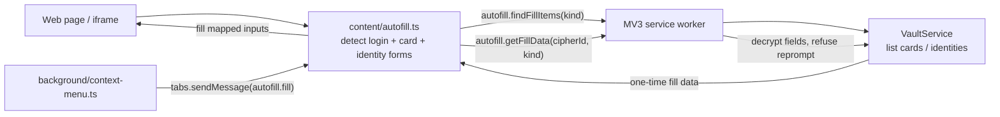

# 卡 / 身份自动填充设计（Card / Identity autofill）

## 1. 目标

在已交付的登录 + TOTP 自动填充之上，为**信用卡（cipher type 3）**与**身份（cipher type 4）**条目增加页面自动填充。目标体验对齐 Bitwarden 官方客户端：

- 页面出现信用卡表单或地址/联系人表单时，在字段旁显示 Vaultwarden 弹层；用户点选某张卡 / 某个身份后，把对应字段写入该表单。
- 在任意页面右键 → Vaultwarden 上下文菜单，选择一张卡 / 一个身份，填入当前表单；右键落在可识别的单个字段上时，额外支持「只填此字段」。

延续既有安全边界：service worker 是唯一持有 UserKey 与明文 vault 的中心；content script 只做 DOM 检测、弹层展示、用户选择与一次性写入。新增能力**不**放宽这条边界。

## 2. 范围与里程碑

本设计拆为两个里程碑，按顺序实现。里程碑 1 自成可交付单元；里程碑 2 在其 worker 能力之上增加上下文菜单入口。

| 项目 | 处理方式 |
| --- | --- |
| 触发方式 | 半自动：表单检测弹层（里程碑 1）+ 右键上下文菜单（里程碑 2），均需显式用户手势 |
| 卡字段 | cardholderName、number、expMonth、expYear、合并 exp、code(CVC) |
| 身份字段 | title、firstName、middleName、lastName、合成全名、address1-3、city、state、postalCode、country、company、email、phone、username |
| 匹配模型 | 卡/身份**无 URI**，不按 URL 匹配；候选为该类型全部条目，按 favorite/名称排序 |
| 卡表单门槛 | 存在 `cc-number` 信号即算卡表单 |
| 身份表单门槛 | **保守**：需地址信号（street-address / address-line1 / postal-code）或姓+名成对 |
| reprompt 条目 | 拒绝页面内释放，提示去扩展验证（复用现有 `reprompt_required`） |
| 身份机密字段 | SSN / 护照号 / 驾照号**不进**表单填充，仅保留扩展内按需揭示 |
| iframe | 复用现有按 frame URL 运行的 content script；卡/身份无 URL 门，按 frame 内表单检测 |
| 自动提交 | 不支持 |

### 里程碑划分

- **里程碑 1 — 表单检测 + 弹层填充**：field-map、field-detection、fill-card-identity 三个新模块 + autofill/popover/vault-service/protocol/router 改造。交付后即可在卡/地址表单上 inline 填充。
- **里程碑 2 — 右键上下文菜单**：manifest 加 `contextMenus` 权限、background/context-menu 模块、content script 新增 `runtime.onMessage` 接收下发指令（整表单填充 + 单字段填充）。

## 3. 架构

复用登录链路的中心化结构，给检测→弹层→worker 全链路引入判别符 `kind: 'login' | 'card' | 'identity'`。登录路径保持默认 `kind:'login'`，逻辑不变。



### 新增模块

- `src/content/field-map.ts`：纯函数，把 `autocomplete` token / name·id·label·aria-label 提示映射到卡/身份字段角色。零 DOM 依赖，单测最密。
- `src/content/field-detection.ts`：`detectCardForms(root)` / `detectIdentityForms(root)`，扫描 input、用 field-map 归类，产出 `{ kind, id, fields, anchor }`。
- `src/content/fill-card-identity.ts`：按角色把解密值写入对应 input，处理合并 exp / 月年拆分，复用 `fill.ts` 的 `setInputValue`。
- `src/background/context-menu.ts`（里程碑 2）：构建/重建上下文菜单，`onClicked` 解析条目并向 tab 下发填充指令。

### 改造模块

- `src/content/autofill.ts`：`attachPopovers` 在登录表单之外，再为卡/身份表单挂带 `kind` 的弹层；里程碑 2 增加 `runtime.onMessage` 监听接收菜单下发。
- `src/content/popover.ts`：按 `kind` 切换头部文案与候选副标题；候选项类型改为可同时承载登录与卡/身份。
- `src/core/vault/vault-service.ts`：新增 `findFillItems(kind)` 与 `getFillData(cipherId, kind)`。
- `src/messaging/protocol.ts` / `src/background/router.ts`：新增 `autofill.findFillItems` / `autofill.getFillData` 两条 typed message。
- `src/manifest.json`（里程碑 2）：`permissions` 增加 `contextMenus`。

## 4. 字段映射（field-map）

特性核心。映射输入为单个 input 的 `autocomplete`、`name`、`id`、`aria-label`、`placeholder`、`type`，输出一个字段角色或 `undefined`。优先读 `autocomplete` token（标准、最可靠），其次 name/id/label 提示。

卡角色：

```ts
type CardRole = 'cardholderName' | 'number' | 'exp' | 'expMonth' | 'expYear' | 'code';
```

| autocomplete token | 角色 | name/id 提示（回退） |
| --- | --- | --- |
| `cc-name` | cardholderName | cardholder, card-name, ccname |
| `cc-number` | number | cardnumber, card-number, ccnum |
| `cc-exp` | exp | card-expiry, exp-date（MM/YY 合并框）|
| `cc-exp-month` | expMonth | exp-month, expmonth |
| `cc-exp-year` | expYear | exp-year, expyear |
| `cc-csc` | code | cvc, cvv, csc, security-code |

身份角色：

```ts
type IdentityRole =
  | 'title' | 'firstName' | 'middleName' | 'lastName' | 'fullName'
  | 'address1' | 'address2' | 'address3' | 'city' | 'state' | 'postalCode' | 'country'
  | 'company' | 'email' | 'phone' | 'username';
```

| autocomplete token | 角色 |
| --- | --- |
| `honorific-prefix` | title |
| `given-name` | firstName |
| `additional-name` | middleName |
| `family-name` | lastName |
| `name` | fullName |
| `street-address` / `address-line1` | address1 |
| `address-line2` | address2 |
| `address-line3` | address3 |
| `address-level2` | city |
| `address-level1` | state |
| `postal-code` | postalCode |
| `country` / `country-name` | country |
| `organization` | company |
| `email` | email |
| `tel` / `tel-national` | phone |
| `username` | username |

设计要点：

- name/id 提示用单词边界正则，避免 `nickname` 命中 `name`、`country` 误伤等。
- `cc-exp` 合并框与 `cc-exp-month`/`cc-exp-year` 互斥：检测时一个 input 只归一个角色。
- 身份 SSN / passportNumber / licenseNumber **不在映射表内**——标准网页表单无对应 token，且属机密，刻意不进页面填充。

## 5. 表单检测（field-detection）

`detectCardForms` / `detectIdentityForms` 复用 `form-detection.ts` 的 `isFillableInput`（可见、可编辑、非 hidden/disabled/readonly）。扫描全部 input、逐个过 field-map、按所在 `<form>` 或近邻容器分组、每组产出一条检测结果，并分配稳定的 `data-vw-fill-id` 以便去重（与登录的 `data-vw-autofill-id` 并存、互不覆盖）。

- **卡表单门槛**：组内存在 `number` 角色字段即算卡表单。锚点优先 number 字段。
- **身份表单门槛（保守）**：组内满足以下之一才算身份表单——
  - 存在地址信号：`address1` 或 `postalCode` 角色；或
  - 同时存在 `firstName` 与 `lastName`（姓+名成对）。
  - 仅有单独 `email` / `phone` / `fullName` **不**触发，避免登录邮箱、订阅框、单字段联系表误弹。锚点优先地址或姓名字段。
- 已被登录检测消费的字段（username/password/totp）不参与卡/身份归类，防止同一字段双挂弹层。

## 6. 填充逻辑（fill-card-identity）

输入为一条检测结果 + worker 返回的字段值，按角色写入。复用 `setInputValue`（写 value 后派发 `input` + `change`，兼容 React/Vue）。

- **合并 exp**：目标是 `exp`（合并框）时，按其 `placeholder`/`maxlength` 选 `MM/YY` 或 `MM/YYYY` 组合 expMonth+expYear。
- **月/年拆分**：目标是 `expMonth`/`expYear` 独立框时，分别写入；`<select>` 月年下拉按 option value/text 匹配。
- **全名合成**：页面只有 `fullName` 框而无姓/名分框时，用 `[title, firstName, middleName, lastName]` 拼接。
- **国家**：`<select>` 时按 option value（ISO）或可见文本匹配，文本框直接写。
- 只填可见、可写字段；缺失的角色跳过，不清空既有值。
- 卡号 + CVC 视同密码：仅在用户显式选择后随本次填充写入。

## 7. Worker API

新增两条 typed message：

```ts
type AutofillFindFillItemsRequest = {
  type: 'autofill.findFillItems';
  kind: 'card' | 'identity';
};

type AutofillGetFillDataRequest = {
  type: 'autofill.getFillData';
  cipherId: string;
  kind: 'card' | 'identity';
};
```

`findFillItems` 读 summary 缓存（无需解密），返回该类型全部条目：

```ts
interface FillItemCandidate {
  id: string;
  name: string;
  subtitle?: string; // 卡品牌 / 身份姓名（已存在的 summary.subtitle）
  favorite: boolean;
  reprompt?: boolean;
}
```

排序：favorite 优先，其次名称 locale-insensitive 排序。锁定 / 未同步时分别抛 `locked` / `sync_required`。

`getFillData` 解密目标条目，按 kind 回传可填字段：

```ts
interface CardFillData {
  cardholderName?: string; number?: string;
  expMonth?: string; expYear?: string; code?: string;
}
interface IdentityFillData {
  title?: string; firstName?: string; middleName?: string; lastName?: string;
  address1?: string; address2?: string; address3?: string;
  city?: string; state?: string; postalCode?: string; country?: string;
  company?: string; email?: string; phone?: string; username?: string;
}
```

`getFillData` 必须：

1. 校验 `cipherId` 对应条目类型与 `kind` 一致（卡↔3、身份↔4），否则 `denied`。
2. **reprompt 条目抛 `reprompt_required`**，绝不在页面内释放机密——与现有 `getAutofillCredentials` 一致；扩展上下文（popup）才是验证主密码的地方。
3. 身份数据**剔除** ssn / passportNumber / licenseNumber，即使解密结构里有也不回传。

## 8. 弹层 UI 泛化

`createAutofillPopover` 引入 `kind`：

- 头部文案：登录 `Fill from Vaultwarden`、卡 `Fill card`、身份 `Fill identity`。
- 候选副标题：登录沿用 username/matchedUri；卡/身份用 `subtitle`（品牌/姓名）。
- 弹层消费一个**公共展示结构** `{ id, name, sub?, favorite, reprompt? }`，由 content script 在拿到候选后归一：登录的 `AutofillCandidate`（保持原样、不动其不变量）映射出 `sub = username ?? matchedUri`，卡/身份的 `FillItemCandidate` 映射出 `sub = subtitle`。popover 自身不再区分登录与卡/身份的原始字段，只按 `kind` 决定头部文案。
- 可信手势（`event.isTrusted`）、closed shadow DOM、定位翻转逻辑全部复用。

## 9. 右键上下文菜单（里程碑 2）

- **manifest**：`permissions` 增加 `contextMenus`。
- **background/context-menu.ts**：
  - 构建父项 `Vaultwarden`，子项 `Fill card ▸ {每张卡}`、`Fill identity ▸ {每个身份}`，菜单项 id 编码 `kind` + `cipherId`。
  - vault sync / unlock 时重建；lock / logout 时移除（锁定不显示条目名）。菜单项只含名称，无机密。
  - `onClicked` → `vault.getFillData(cipherId, kind)`（reprompt 抛错则转为提示）→ `tabs.sendMessage(tabId, { type:'autofill.fill', kind, data, frameId })`。
- **content script `runtime.onMessage`**：
  - 默认：在当前 frame 检测该 kind 的表单并整表单填充。
  - 单字段：content script 监听 `contextmenu` 事件暂存最近右键的元素；若该元素可经 field-map 归出角色，则只把对应值写入该元素（「只填此字段」）。
  - 收到 `reprompt_required` 提示时显示「请在扩展中验证主密码」，不填充。

## 10. 安全边界

- Master password、MasterKey、UserKey、明文 vault 仍不得进入 content script。
- **无 URL 门是有意的**：卡/身份本就无 URI；授权来自**显式可信用户手势**（点弹层候选 / 选菜单项，均校验 `event.isTrusted` 或来自扩展的可信消息）+ **reprompt 门**。这与 Bitwarden 一致——卡/身份可在用户选择的任意页面填充。
- reprompt 条目一律拒绝页面内释放，引导去扩展验证。
- 身份 SSN / 护照 / 驾照号不进页面填充，仅扩展内按需揭示。
- 卡号 + CVC 仅在用户显式选择后随本次填充返回一次，不持久化、不写 DOM attribute / console / 页面全局。
- 不填 hidden / disabled / readonly 字段；不自动提交表单。
- 菜单下发的填充指令只来自本扩展 background（`tabs.sendMessage`），content script 校验消息来源为扩展运行时。

## 11. 测试计划

自动化：

- `field-map.test.ts`：卡/身份每个 autocomplete token 与 name/id 回退命中；`nickname`/`country` 等易混淘汰；exp 合并 vs 月年互斥。
- `field-detection.test.ts`：卡门槛（有 number 才算）；身份保守门槛（地址信号或姓+名才算，单 email/phone 不算）；与登录字段不双挂；动态容器分组与去重。
- `fill-card-identity.test.ts`：合并 exp MM/YY 与 MM/YYYY、月年独立框、`<select>` 月/年/国家匹配、全名合成、缺失角色跳过、触发 `input`/`change`。
- `vault-service.test.ts`：`findFillItems` 返回全量并排序、不含机密；`getFillData` 类型校验、reprompt 抛错、身份机密字段被剔除。
- `router.test.ts`：`autofill.findFillItems` / `autofill.getFillData` 分支；kind 不符与 reprompt 的错误码。
- `protocol` / `manifest.test.ts`：新消息类型；里程碑 2 manifest 含 `contextMenus`。
- 里程碑 2：context-menu 单测（构建/重建/锁定清除、onClicked 解析、下发消息形状）；content script `onMessage` 整表单 vs 单字段填充、reprompt 提示。

人工验收：

1. 登录并同步含卡 + 身份条目的 vault。
2. 打开信用卡结账页，确认 number 字段旁出现弹层，点选卡后 number/exp/CVC/持卡人正确填入（含合并 exp 与月年下拉）。
3. 打开收货地址页，确认地址信号触发身份弹层，点选身份后姓名/地址/城市/邮编/国家/电话/邮箱填入。
4. 在仅有单个邮箱/订阅框的页面，确认**不**弹身份层。
5. 登录页邮箱框只弹登录层、不弹身份层。
6. reprompt 卡/身份：弹层提示去扩展验证，页面不被填充。
7. 里程碑 2：右键 → Vaultwarden → Fill card / Fill identity，整表单填充；右键落在单个字段上时「只填此字段」生效；锁定后菜单不显示条目。

## 12. 非目标

- Argon2id KDF（按 `CLAUDE.md` 范围决策暂不实现）。
- 身份 SSN / 护照 / 驾照页面填充。
- 卡/身份的 URL 匹配（设计上不需要）。
- 自动提交、保存/更新卡或身份提示。
- 第三方页面专有非标字段的启发式扩展（仅覆盖标准 autocomplete + 常见 name/id 提示）。
- 多凭据快捷键、徽章计数等其他独立路线图项。
