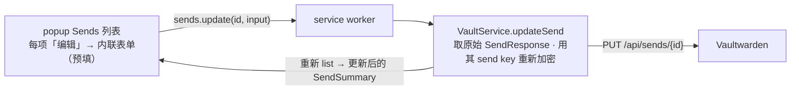

# 编辑现有 Send 设计（Edit existing Send）

## 1. 目标

为已交付的 Sends（文本 + 文件 + 接收端）补上最后一块：**编辑现有 Send 的元数据**。编辑**复用现有 send key**（不换密钥），因此已分发的分享链接继续有效；accessId、文件本身、文件名都不变。

## 2. 范围

| 项目 | 处理方式 |
| --- | --- |
| 可编辑（文本 + 文件 Send 通用） | 名称、最大访问次数、禁用开关、密码（保留/更改/移除）、过期日期、删除日期 |
| 仅文本 Send 额外可编辑 | 文本内容、默认隐藏开关 |
| 文件 Send | **文件与文件名不可改**（Bitwarden 同）；沿用 `existing.file.fileName` |
| send key | **不变**——从 `existing.key`（userKey 包裹）解出，重新加密改动字段；`key` 原样回传 |
| 端点 | `PUT /api/sends/{id}`（JSON，与 create 同） |
| 不在范围 | 改文件内容、改 send 类型（text↔file）、批量编辑 |

## 3. 架构



### 改造模块
- `src/core/vault/sends.ts`：`buildUpdateSendRequest(existing, input, userKey)` + `UpdateSendInput` 类型。
- `src/core/api/client.ts`：`updateSend(token, id, req)`（PUT `/api/sends/{id}`）+ `removeSendPassword(token, id)`（PUT `/api/sends/{id}/remove-password`）。
- `src/core/vault/vault-service.ts`：`updateSend(id, input, serverUrl)`。
- `src/messaging/protocol.ts` / `src/background/router.ts`：`sends.update`。
- `src/ui/popup/popup.ts`：Sends 列表项「编辑」按钮 + 内联编辑表单。
- `test/live/sends.live.test.ts`：追加编辑往返用例。

## 3a. 已实测协议（Vaultwarden 2025.12，probe 确认）

> 密码语义经真实服务端验证，与直觉不同——故下文据实设计：

- 服务端**二次哈希**存储密码：返回的 `existing.password` ≠ 客户端 `hashSendPassword(pw, sendKey)`，**不可重发**。
- **保留密码**：PUT 时**省略 `password` 字段**（null 也视为保留）。
- **设新密码**：`password = hashSendPassword(newPassword, sendKey)`（客户端哈希；访问时服务端按此比对，create 流程已验证正确）。
- **移除密码**：`password: null`/`""` **均无效**；须调用专用端点 `PUT /api/sends/{id}/remove-password`（空体 `{}`）。
- PUT 接受不变的 `key` 与文件 Send 的 `file.fileName`（不重传文件）。

## 4. 数据模型

```ts
// sends.ts —— 编辑输入。未提供的字段表示「保留现有值」。
interface UpdateSendInput {
  name: string;               // 总是重设（表单预填当前名）
  text?: string;              // 文本 Send：新文本（文件 Send 忽略）
  hidden?: boolean;           // 文本 Send：默认隐藏
  disabled?: boolean;         // 禁用开关
  maxAccessCount?: number;    // >0 设置；0/未填 → 清除上限（null）
  /** 密码三态：'keep'（默认，重发原哈希）| 'remove'（置 null）| 设新值（newPassword）。 */
  passwordMode?: 'keep' | 'remove' | 'set';
  newPassword?: string;       // passwordMode==='set' 时使用
  /** 天数；未提供 → 保留 existing 的对应日期。 */
  expirationDays?: number;    // >0 从现在起重设；未填保留；显式清除见下
  deletionDays?: number;      // >0 从现在起重设；未填保留 existing.deletionDate
}
```

## 5. 构造编辑请求（buildUpdateSendRequest）

```text
sendKey = decryptToBytes(existing.key, userKey)   // 现有 send key（16 字节）
derived = deriveSendKey(sendKey)
request.type        = existing.type               // 不改类型
request.key         = existing.key                // 不变
request.name        = encryptToText(input.name, derived)
if type === 0 (text): request.text = { text: encryptToText(input.text ?? '', derived), hidden: input.hidden ?? false }
if type === 1 (file): request.file = { fileName: existing.file.fileName }   // 文件名不变
request.disabled    = input.disabled ?? false
request.hideEmail   = existing.hideEmail ?? false
// 最大访问次数：>0 设置，否则 null（清除）
request.maxAccessCount = (input.maxAccessCount && input.maxAccessCount > 0) ? trunc : null
// 删除日期：填天数→从现在起重设；否则保留 existing.deletionDate
request.deletionDate = input.deletionDays>0 ? now()+clamp(days,1,31)*DAY : existing.deletionDate
// 过期日期：填天数→重设；否则保留 existing.expirationDate（可能为 null）
request.expirationDate = input.expirationDays>0 ? now()+days*DAY : existing.expirationDate ?? null
// 密码三态（见 §3a 实测语义）
passwordMode==='set'    → request.password = hashSendPassword(input.newPassword, sendKey)  // 客户端哈希
passwordMode==='keep'   → 省略 request.password 字段                                       // 不重发原哈希
passwordMode==='remove' → 省略 request.password 字段；由 vault-service 另调 removeSendPassword 端点
```

> **密码保留**＝PUT 省略 `password`（实测：服务端二次哈希存储，重发原哈希会被再哈希一次而破坏密码）。
> **移除密码**＝单独 `PUT /api/sends/{id}/remove-password`（实测：`password: null`/`""` 都不清除）。

## 6. Worker 编排（vault-service.updateSend）

```text
updateSend(id, input, serverUrl):
  userKey = requireUserKey(); token = requireToken()
  sends = api.listSends(token)                 // 取原始 SendResponse[]
  existing = sends.find(s => s.id === id)       // 找到该 Send 的密文
  if !existing: throw AppError('error', 'Send not found')
  request = buildUpdateSendRequest(existing, input, userKey)   // keep/set 处理；remove 时省略 password
  api.updateSend(token, id, request)            // PUT 元数据（密码 keep）
  if input.passwordMode === 'remove': api.removeSendPassword(token, id)   // 专用端点清除密码
  return decryptSend(<重新 listSends 取该 id 的最新 SendResponse>, userKey, serverUrl)
```

回传方式：**重新 `listSends` 取该 id 的最新 SendResponse 解密回传**（最稳，反映服务端 revisionDate / 密码清除后的实际状态）。

## 7. popup UI

Sends 列表每项的操作行增加「编辑」按钮（与现有复制/删除并列）。点击 → 在该项下展开内联编辑表单（或切到编辑视图），预填：
- 名称（当前名）、文本 Send 的文本 + 隐藏勾选；
- 最大访问次数（当前值）、禁用勾选；
- 密码：留空框 + 占位「留空保留当前密码」；当前有密码时显示「移除密码」勾选框；
- 删除/过期天数框（占位显示当前绝对日期，留空=保留）。

保存 → `sends.update`，成功后刷新列表、提示成功。

## 8. 安全 / 边界
- 编辑在 worker：userKey 解 send key、重新加密；popup 仅传明文输入、拿回 SendSummary（含分享 URL，不含 send key 外机密）。
- send key 不变 → 已分发链接继续有效。
- reprompt 不适用（Sends 非 vault 条目）。
- 文件 Send 不重传文件，PUT 仅元数据。

## 9. 错误处理

| 场景 | 表现 |
| --- | --- |
| Send 不存在（已删/过期） | 「Send not found」，刷新列表 |
| 服务器 URL 未配置 | 「Server URL is not configured」 |
| PUT 失败（4xx/5xx） | 透传错误信息 |
| 名称为空 | 默认回退（'Send' / 文件名），不报错 |

## 10. 测试计划

自动化：
- `sends.test.ts`：`buildUpdateSendRequest` —— 改名往返；文本 Send 改文本/隐藏；文件 Send 沿用 `existing.file.fileName`、`key` 不变；密码三态（keep→不含 password 字段、set→新客户端哈希、remove→不含 password 字段）；删除/过期天数留空保留、填值重设；maxAccessCount 清除。
- `client.test.ts`：`updateSend` PUT `/api/sends/{id}` 形状 + content-type；`removeSendPassword` PUT `/api/sends/{id}/remove-password`。
- `vault-service.test.ts`：`updateSend` 编排（取原始→PUT→回传；Send 不存在抛错；`passwordMode==='remove'` 时额外调用 `removeSendPassword`）。
- `router.test.ts`：`sends.update` 路由（带 serverUrl）。
- `LIVE=1`（追加到 `test/live/sends.live.test.ts`）：建带密码文本 Send → update（改名 + 改文本，**保留密码**）→ 接收路径验证新名/新文本 + 带密码访问仍生效；再 update（passwordMode='remove'）→ 验证无密码访问生效。

人工验收：
1. 建文本 Send → 列表「编辑」→ 改名/改文本/设最大次数 → 保存 → 列表反映改动；分享链接不变仍可访问。
2. 给无密码 Send 加密码 → 接收页需密码。给有密码 Send「移除密码」→ 接收页不再需密码。
3. 文件 Send「编辑」→ 改名/禁用/过期 → 文件下载仍正常（文件未变）。

## 11. 非目标
- 改文件内容 / 文件名 / send 类型。
- 批量编辑、编辑历史。
- i18n。
