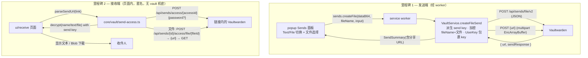

# 文件 Sends + 接收端访问页设计（File Sends & receive page）

## 1. 目标

在已交付的**文本 Sends**（HKDF 派生 send key、创建/列表/删除、密码哈希、分享链接）之上，补齐 Sends 里程碑的两块：

- **发送端**：创建**文件 Send**——本地加密文件 + 上传 + 在列表中显示。
- **接收端**：一个独立扩展页，粘贴 Send 分享链接后**匿名访问 + 解密**文本、或**下载并解密**文件。

延续既有安全模型：含 vault 机密（UserKey、主密码、明文库）的操作仍只在 service worker。接收端**不涉及任何 vault 机密**（send key 来自链接、对收件人本就公开），因此在页面内自包含完成——这不放宽 worker 中心化边界，因为这里没有 vault 机密。

## 2. 范围与里程碑

| 项目 | 处理方式 |
| --- | --- |
| 文件 Send 创建 | worker 内加密文件（EncArrayBuffer）+ v2 两步上传；popup「Text/File」切换 + 文件选择器 |
| 文件 Send 列表 | `decryptSend` 扩展处理 type=1，显示文件名/大小 |
| 接收端 | 独立扩展页：粘贴链接 → 匿名访问 → 解密文本 / 下载解密文件 |
| 密码保护 Send | 收件人输密码 → `hashSendPassword(pwd, sendKey)` 随请求提交 |
| 上传 API | **v2**：`POST /api/sends/file/v2` → `POST {返回的 url}`（multipart） |
| 文件加密 | **复用** `attachments.ts` 的 EncArrayBuffer（`encryptAttachmentFile`/`decryptAttachmentFile`）配 send key |
| 跨服务器 | 链接自带 serverUrl；未授权 origin 在用户手势内 `chrome.permissions.request` |
| 编辑现有 Send | **不在本次范围**（另起里程碑） |

### 里程碑划分

- **里程碑 1 — 发送端：文件 Send 创建**：`sends.ts` 文件构造 + `decryptSend` type=1、`client.ts` v2 上传、`vault-service.createFileSend`、protocol/router、popup 面板扩展。交付后可创建并分享文件 Send。
- **里程碑 2 — 接收端：访问页**：`send-access.ts` 核心 + `ui/receive` 页面 + popup 入口 + `build.mjs` 入口。交付后可在扩展内接收任意文本/文件 Send。

## 3. 架构



### 新增模块
- `src/core/vault/send-access.ts`：接收端核心（纯，注入 `fetch`）。`parseSendUrl` / `accessSend` / `decryptAccessedSend` / `requestFileDownloadUrl` / `downloadAndDecryptFile`。
- `src/ui/receive/receive.html` + `src/ui/receive/receive.ts` + `receive.css`：接收页（打包入口）。

### 改造模块
- `src/core/vault/sends.ts`：`buildFileSendRequest`、`encryptSendFile`、`decryptSend` 支持 type=1、`SendSummary.fileName`/`SendInput` 文件字段。
- `src/core/api/client.ts`：`createSendFile`、`uploadSendFileData`。
- `src/core/vault/vault-service.ts`：`createFileSend`。
- `src/messaging/protocol.ts` / `src/background/router.ts`：`sends.createFile`。
- `src/ui/popup/popup.ts`：Sends 面板加 Text/File 切换、文件选择、Receive 入口。
- `src/manifest.json`：新增 `web_accessible_resources` 非必要——receive 是扩展页（`chrome-extension://`），与 options 同类，**无需新权限**；host 权限走既有 `optional_host_permissions`。
- `build.mjs`：`ui/receive/receive` 入口 + 静态资源拷贝。

## 4. 加密与 EncArrayBuffer 复用

文件 Send 与附件用**同一** EncArrayBuffer 文件格式：`[encType=2 (1B)] ‖ iv(16) ‖ mac(32) ‖ ciphertext`，Encrypt-then-MAC。send key 经 `deriveSendKey(sendKey)`（HKDF-Expand → 64B = enc‖mac）得到 `SymmetricKey`，直接喂给 `encryptAttachmentFile(data, derivedKey)` / `decryptAttachmentFile(buf, derivedKey)`。

文件名是 EncString（`encryptToText(fileName, derivedKey)`），与文本 Send 的 name/text 同密钥。

## 5. 文件 Send 创建流程（里程碑 1）

1. popup：用户选「File」、选文件 → 读为字节 → base64 → `sends.createFile{ input(name/password/过期/删除/最大访问), dataB64, fileName }`。
2. worker `createFileSend`：
   - `sendKey = random(16)`；`derived = deriveSendKey(sendKey)`。
   - `encFileName = encryptToText(fileName, derived)`；`encName = encryptToText(input.name||fileName, derived)`。
   - `blob = encryptAttachmentFile(fileBytes, derived)`（EncArrayBuffer）。
   - `key = encryptToBytes(sendKey, userKey)`（UserKey 包裹）。
   - 请求体 `SendRequest{ type:1, name:encName, key, file:{ fileName:encFileName }, fileLength:blob.length, deletionDate, maxAccessCount?, expirationDate?, password? }`。
   - `POST /api/sends/file/v2`（JSON）→ `{ url, sendResponse }`。
   - `POST {url}`（multipart：字段 `data` = blob，文件名用 encFileName 或占位）→ 204。
   - 返回 `decryptSend(sendResponse, userKey, serverUrl)`（含分享 URL）。
3. 列表：`decryptSend` 对 type=1 解 `file.fileName` 填 `SendSummary.fileName`、`size` 取 `file.size/sizeName`。

> 上传体大小上限（内存）：默认 100 MB，popup 端超限即拒绝并提示。

## 6. 接收端访问流程（里程碑 2）

接收页**不经 worker**、**不带 auth token**。

1. `parseSendUrl(link)`：识别 `{server}/#/send/{accessId}/{base64url(sendKey)}` → `{ serverUrl, accessId, sendKey:Uint8Array }`。非法链接抛错。
2. 权限：若 `serverUrl` 的 origin 未在 host 权限内，用户点 Access（手势）时 `chrome.permissions.request({ origins:[origin+'/*'] })`；拒绝则提示。仅 `http:`/`https:`。
3. `accessSend(fetch, serverUrl, accessId, passwordHash?)`：`POST /api/sends/access/{accessId}`，体 `{ password? }`（密码保护时 `password = hashSendPassword(pwd, sendKey)`）。401/403 → 密码错/禁用/超额，分别提示。返回 access 响应（`to_json_access`：name/text/file 为 EncString，无 key）。
4. `decryptAccessedSend(resp, sendKey)`：`derived = deriveSendKey(sendKey)`；解 `name`；type=0 解 `text.text`；type=1 解 `file.fileName`（仅文件名，blob 另取）。
5. 文件下载：`requestFileDownloadUrl(fetch, serverUrl, sendId, fileId, passwordHash?)`：`POST /api/sends/{id}/access/file/{fileId}` `{ password? }` → `{ url }`；`downloadAndDecryptFile`：GET `url`（绝对或相对+serverUrl）→ EncArrayBuffer → `decryptAttachmentFile(buf, derived)` → `Blob` → `<a download=fileName>` 触发下载。
   - **路由里的 `{id}`** 取自步骤 3 的 access 响应（`resp.id`），`fileId` 取自 `resp.file.id`——收件人只持有 accessId，故 `sendId`/`fileId` 一律从 access 响应读出，**不自行拼接**；该 id 语义（accessId vs 内部 sendId）由 `LIVE=1` 真实服务端测试核实后固定。
6. 显示：文本 Send 显示名 + 文本（带隐藏/揭示）；文件 Send 显示名 + 文件名/大小 + 「下载」按钮。展示访问计数/过期信息（若响应含）。

## 7. 数据模型

```ts
// sends.ts —— SendInput 增加文件相关（仅文件 Send 用）
interface SendInput {
  name: string;
  text?: string;          // 文本 Send
  hidden?: boolean;
  password?: string;
  maxAccessCount?: number;
  expirationDays?: number;
  deletionDays: number;
}
// 文件 Send 的字节与文件名经 createFile 消息单独传递（不放进 SendInput）。

// SendSummary 增加文件展示字段
interface SendSummary {
  /* …现有… */
  type: number;           // 0 text, 1 file
  fileName?: string;      // 文件 Send 的解密文件名
  sizeName?: string;      // 人类可读大小（来自 file.sizeName）
}

// send-access.ts
interface ParsedSendUrl { serverUrl: string; accessId: string; sendKey: Uint8Array }
interface AccessedSend {
  id: string;             // access 响应回传的 id，用于文件下载路由（见 §6.5）
  type: number; name: string; text?: string; hidden: boolean;
  fileName?: string; fileId?: string; sizeName?: string;
  accessCount?: number; maxAccessCount?: number; expirationDate?: string;
}
```

## 8. 安全边界

- 接收页用 send key（链接内、对收件人公开）解密；**无 UserKey/主密码/明文库入场**——页面内自包含解密不破坏 worker 中心化模型。
- 文件 Send 创建仍在 worker：UserKey 包裹 send key；明文文件只在 worker 内加密为 EncArrayBuffer；popup 仅传 base64 字节、拿回 SendSummary。
- EncArrayBuffer 解密做 MAC 校验，失败即抛（防篡改 / 错 key）。
- 接收页对任意链接 origin 的请求经 `chrome.permissions.request` 显式授权（用户手势内），仅 http/https；响应一律按密文/不可信数据处理。
- 不把 send key、明文文件、密码写入 `storage`/console/DOM attribute；接收页 URL 里的 send key 用后不持久化。
- 文件大小上限防内存耗尽。

## 9. 错误处理

| 场景 | 表现 |
| --- | --- |
| 链接格式非法 | 「Invalid Send link」 |
| 需要密码 / 密码错 | 显示密码输入；错误提示「Incorrect password」 |
| Send 禁用 / 过期 / 超额 | 「This Send is no longer available」 |
| origin 权限被拒 | 「Grant access to {host} to receive this Send」 |
| MAC 校验失败 | 「Could not decrypt — the link or file may be corrupted」 |
| 上传体过大（发送端） | popup 前端拒绝并提示上限 |

## 10. 测试计划

自动化：
- `sends.test.ts`：`buildFileSendRequest` 往返（type=1、fileName/key/fileLength、加密文件 EncArrayBuffer 往返 + 防篡改）；`decryptSend` type=1 解出 fileName。
- `send-access.test.ts`：`parseSendUrl`（合法/非法/缺 key）；`accessSend`（注入 fake fetch，密码哈希提交、401 分支）；`decryptAccessedSend`（text/file）；`downloadAndDecryptFile`（fake fetch 返回 EncArrayBuffer → 解密往返、坏 MAC 抛错）。
- `client.test.ts`：`createSendFile`（POST v2 体/返回）、`uploadSendFileData`（multipart 形状）。
- `vault-service.test.ts`：`createFileSend` 编排（建档→上传→解密回传；不含机密泄漏）。
- `router.test.ts` / protocol：`sends.createFile` 分支。
- `manifest.test.ts` / build：receive 入口被打包；无新增 manifest 权限。
- 真实服务端（`LIVE=1`，CLAUDE.md 测试 Vaultwarden 2025.12）：建文件 Send → 列表 → 用其 access URL 走 `accessSend`+`downloadAndDecryptFile` 解密往返。

人工验收：
1. popup Sends → File，选文件、设密码/过期 → 创建成功、得分享链接。
2. 列表显示该文件 Send（文件名/大小）。
3. 接收页粘贴该链接 → Access →（输密码）→ 「下载」得到原文件。
4. 文本 Send 链接 → 接收页显示文本。
5. 错密码 / 过期 / 超额 / 非法链接分别给出对应提示。

## 11. 非目标

- 编辑现有 Send（PUT /api/sends）—— 另起里程碑。
- 旧版 `POST /api/sends/file` 单请求上传（用 v2）。
- 接收页拦截 `{server}/#/send/...` 导航（仅手动粘贴）。
- 大文件分片/流式加密（单块全量加密，受大小上限约束）。
- Send 列表的文件 Send「下载自己的文件」（发送者可用分享链接经接收页自取）。
- i18n。
