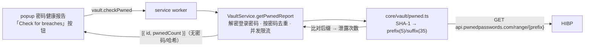

# HIBP 泄露检测设计（Have I Been Pwned — Pwned Passwords）

## 1. 目标

在已交付的密码健康报告（弱密码 + 重复）之上，增加**泄露密码检测**：用 HIBP Pwned Passwords 的 k-anonymity API 查询每个登录密码是否出现在已知数据泄露中，报告泄露次数。

**隐私核心**：SHA-1 在 worker 内计算，只把哈希的**前 5 位十六进制前缀**发给 HIBP；完整密码与完整哈希绝不出 worker；跨消息边界只回传每条的泄露次数。

## 2. 范围

| 项目 | 处理方式 |
| --- | --- |
| 检测方式 | HIBP Pwned Passwords range API（k-anonymity，匿名、无 API key、只读 GET）|
| 触发 | 按需——密码健康报告加「Check for breaches」按钮；不自动/定时扫描 |
| 计算位置 | worker：`SHA-1(password)` → 前 5 位前缀查询、比对后缀 |
| 去重 | 按密码去重（多条共用同一密码只查一次），映射回各 id |
| 网络权限 | manifest `host_permissions` 加 `https://api.pwnedpasswords.com/*`（安装时授予）|
| 隐私加固 | 请求带 `Add-Padding: true`（混淆返回结果数）|
| 不在范围 | 结果缓存、定时扫描、账户级 HIBP（breaches-by-email，需 API key） |

## 3. 架构



### 新增模块
- `src/core/vault/pwned.ts`：`sha1Hex`、`pwnedCount`。
- `src/core/vault/pwned.test.ts`。

### 改造
- `src/core/vault/vault-service.ts`：`getPwnedReport()`。
- `src/core/vault/vault-service.test.ts`。
- `src/messaging/protocol.ts` / `src/background/router.ts`：`vault.checkPwned`。
- `src/manifest.json`：`host_permissions` 加 HIBP 主机。
- `src/manifest.test.ts`：断言。
- `src/ui/popup/popup.ts`：健康报告加「Check for breaches」按钮 + 标注。
- `test/live/`（可选）：真实 HIBP 契约测试（`LIVE=1`）。

## 4. 接口 / 数据模型

```ts
// pwned.ts
/** Uppercase hex of SHA-1(text) (HIBP uses uppercase). */
export function sha1Hex(text: string): Promise<string>;

/**
 * HIBP Pwned Passwords k-anonymity lookup: SHA-1 the password, send only the 5-char prefix, match the
 * suffix in the returned range. Returns the breach count (0 if not found). Throws on a network/HTTP error.
 * `fetchFn` and `sha1` are injectable for tests.
 */
export function pwnedCount(
  password: string,
  fetchFn?: typeof fetch,
  sha1?: (text: string) => Promise<string>,
): Promise<number>;

// vault-service → popup（跨边界只含次数）
interface PwnedEntry { id: string; pwnedCount: number }
// protocol: { type: 'vault.checkPwned' } → { ok: true; data: { entries: PwnedEntry[] } }
```

## 5. HIBP 查询细节（pwned.ts）

- `sha1Hex(text)`：`crypto.subtle.digest('SHA-1', utf8(text))` → 字节 → 大写 hex（40 字符）。
- `pwnedCount(password, fetchFn=fetch, sha1=sha1Hex)`：
  1. `hash = await sha1(password)`；`prefix = hash.slice(0,5)`；`suffix = hash.slice(5)`（35 字符，大写）。
  2. `GET https://api.pwnedpasswords.com/range/${prefix}`，头 `{ 'Add-Padding': 'true' }`。非 2xx 抛错。
  3. 响应文本按行分割；每行 `HASHSUFFIX:COUNT`（后缀大写）；找到等于 `suffix` 的行 → 返回其 `COUNT`（整数）；未找到（含 padding 行 `...:0`）→ 0。
- 只有 `prefix`（5 字符）出现在 URL 中；password / 完整 hash / suffix 都不发给服务器（suffix 仅本地比对）。

## 6. Worker 编排（vault-service.getPwnedReport）

```text
getPwnedReport():
  userKey = requireUserKey(); (解密来源同 getPasswordHealth：VAULT_CACHE 的登录条目)
  logins = 解密所有 type=1 且有 password 的条目 → [{ id, password }]
  uniq = 按 password 去重 → Map<password, count>
  for each unique password（并发限流，如 6）：n = await pwnedCount(password)
  返回 logins.map(l => ({ id: l.id, pwnedCount: byPassword.get(l.password) })) 
  // 只回传 { id, pwnedCount }；password 不出 worker
```

- 复用 `getPasswordHealth` 的解密路径（同样在 worker 内解密登录密码）。
- 单个密码查询失败：整体抛 `AppError('error', 'Could not reach the breach service')`（popup 显示错误）；MVP 不做部分结果。
- 并发限流避免一次性打出几十个请求。

## 7. popup UI

- 密码健康报告（`getPasswordHealth` 渲染的列表）底部加「Check for breaches」按钮。
- 点击 → `vault.checkPwned` → 把返回的 `pwnedCount` 按 id 标注到对应条目：`pwnedCount>0` → 「⚠️ Found in N breaches」（醒目色）；`=0` → 「✓ Not found」。
- 加载中禁用按钮、显示进行中；错误显示 `Could not reach the breach service`。

## 8. 安全 / 边界
- 只发 5 位 SHA-1 前缀；完整密码/哈希不出 worker；健康报告只含次数（无密码）。
- HIBP 匿名只读 GET、无凭据；`Add-Padding` 隐藏命中数。
- 按需触发（用户点击），不自动/定时；不写 `storage`/console 明文。
- 新增 host_permission 仅 `api.pwnedpasswords.com`（固定、只读、隐私保护）。

## 9. 错误处理

| 场景 | 表现 |
| --- | --- |
| 无网络 / HIBP 不可达 / 非 2xx | 「Could not reach the breach service」 |
| 库锁定 | 「Vault is locked」（复用现有守卫）|
| 无登录密码 | 空报告（按钮无可查项）|

## 10. 测试计划

- `pwned.test.ts`（注入 fake fetch + 可注入 sha1）：
  - `sha1Hex('password')` = `5BAA61E4C9B93F3F0682250B6CF8331B7EE68FD8`（大写，已知向量）。
  - `pwnedCount`：fake fetch 返回含目标 suffix 的 range → 正确 count；不含 → 0；URL 只含前 5 位；带 `Add-Padding` 头；非 2xx → 抛错。
- `vault-service.test.ts`：`getPwnedReport` 去重（两条同密码只查一次）、映射回各 id、返回不含密码；锁定抛错。
- `router.test.ts` / protocol：`vault.checkPwned` 分支。
- `manifest.test.ts`：`host_permissions` 含 `https://api.pwnedpasswords.com/*`。
- `LIVE=1`（可选，`test/live/pwned.live.test.ts`）：真实 HIBP 查 `'password'` → count > 0。
- popup：`npm run typecheck` + `npm run build` + 人工冒烟。

## 11. 非目标
- 结果缓存 / 定时后台扫描 / 徽章计数。
- 账户级 HIBP（breaches by email，需 API key）。
- 密码历史条目的泄露检测（仅当前登录密码）。
- i18n。
