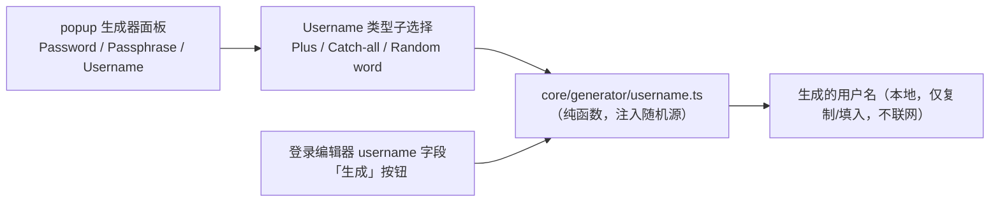

# 用户名生成器（本地类型）设计（Username generator — local types）

## 1. 目标

在已交付的密码/口令生成器之上，增加**本地用户名生成**——三种不联网、无外部依赖的类型：加号别名（plus-addressed）、catch-all 邮箱、随机词用户名。全部纯本地计算，不涉及 vault 机密、不联网、不落 `storage`。

转发邮箱别名（SimpleLogin / addy.io / Firefox Relay 等外部 provider）**不在本次范围**，另起里程碑。

## 2. 范围

| 项目 | 处理方式 |
| --- | --- |
| Plus-addressed | `base` → `local+<随机>@domain`（拆 `@` 后在 local 部插入 `+随机`）|
| Catch-all | `<随机>@domain` |
| Random word | 词表随机词，可 capitalize、可附 0-9 数字（复用 `PASSPHRASE_WORDLIST`）|
| 随机串 | `randomAlphanumeric(len)`：小写字母 + 数字，默认 8 位（复用 `cryptoRandomInt` 去偏）|
| 面板 | 生成器分段加「Username」；类型子选择 + 类型输入；复用 readout/生成/复制/历史 |
| 编辑器集成 | 登录条目编辑器 username 字段旁加「生成」按钮（Random-word 快速填入）|
| 不在范围 | 转发邮箱 provider、生成器配置持久化 |

## 3. 架构



### 新增模块
- `src/core/generator/username.ts`：`generatePlusAddressedEmail` / `generateCatchAllEmail` / `generateRandomWordUsername` / `randomAlphanumeric` + 选项类型 + 默认值。
- `src/core/generator/username.test.ts`。

### 改造
- `src/ui/popup/popup.ts`：生成器面板加 Username 模式；登录编辑器 username 字段加生成按钮。

## 4. 数据模型 / 接口

```ts
export type UsernameType = 'plusAddressed' | 'catchAll' | 'randomWord';

export interface UsernameGenOptions {
  /** Random local-part / suffix length for plus-addressed & catch-all. */
  randomLength: number;      // default 8, clamped 4..32
  capitalize: boolean;       // random-word
  includeNumber: boolean;    // random-word: append one 0-9 digit
}

export const DEFAULT_USERNAME_OPTIONS: UsernameGenOptions = { randomLength: 8, capitalize: false, includeNumber: false };

/** `local+<random>@domain`. If baseEmail has no '@', treat the whole thing as the local part with no domain. */
export function generatePlusAddressedEmail(baseEmail: string, options: UsernameGenOptions, randomInt?): string;

/** `<random>@domain` (domain trimmed of a leading '@'). Empty domain → just the random local part. */
export function generateCatchAllEmail(domain: string, options: UsernameGenOptions, randomInt?): string;

/** A random word, optionally capitalized, optionally with a trailing 0-9 digit. */
export function generateRandomWordUsername(options: UsernameGenOptions, randomInt?, words?): string;

/** Lowercase letters + digits, unbiased (rejection sampling via cryptoRandomInt). */
export function randomAlphanumeric(length: number, randomInt?): string;
```

- `randomInt` 默认 `cryptoRandomInt`（`password.ts` 已导出），注入以便确定性单测。
- `words` 默认 `PASSPHRASE_WORDLIST`。

## 5. 生成规则

- **Plus-addressed**：`baseEmail.split('@')` → `[local, domain?]`；结果 `${local}+${randomAlphanumeric(len)}${domain ? '@'+domain : ''}`。base 前后 trim；无 `@` 时无域名部分。
- **Catch-all**：`domain` 去掉可能的前导 `@` 与空白 → `${randomAlphanumeric(len)}${domain ? '@'+domain : ''}`。
- **Random word**：从词表随机取一词；`capitalize` → 首字母大写；`includeNumber` → 追加一个 `randomInt(10)` 数字。
- `randomAlphanumeric(len)`：字符集 `abcdefghijklmnopqrstuvwxyz0123456789`（36），逐位 `charset[randomInt(36)]`。

## 6. popup UI

- 生成器分段：`Password / Passphrase / Username`（新增 genMode 值 `'username'`）。
- Username 模式：
  - 类型子分段：`Plus-addressed / Catch-all / Random word`（popup 局部状态 `usernameType`）。
  - Plus：base email 输入（预填活动账户邮箱，来自 `auth.listAccounts` 的活动项；可改）。
  - Catch-all：域名输入（手填，占位 `example.com`）。
  - Random word：`Capitalize` / `Include number` 勾选。
  - 通用：随机串长度输入（plus/catch-all 显示）。
- 复用现有 readout（生成值 + 重新生成）、Copy、历史（内存、登出即清）。
- 类型/选项变更即时重算显示；重新生成/打开时把上一个记入历史。

## 7. 编辑器集成

登录条目编辑器（cipher editor）的 username 字段旁加一个小「生成」按钮，点击用 `generateRandomWordUsername(DEFAULT_USERNAME_OPTIONS)` 填入该字段（最常用、无需额外输入）。与现有 password 字段的生成按钮对称。

## 8. 安全 / 边界
- 全部本地纯计算：不涉及 UserKey/主密码/明文库、不联网、不写 `storage`/DOM attribute（除生成值填入表单/复制）。
- 生成历史仅驻内存（popup 生命周期），与现有密码历史一致，登出即清。
- 随机源为 `crypto.getRandomValues`（经 `cryptoRandomInt` 去偏），可注入以确定性测试。

## 9. 测试计划

- `username.test.ts`（注入确定性 `randomInt`）：
  - `randomAlphanumeric`：长度、字符集仅小写+数字。
  - `generatePlusAddressedEmail`：`a@b.com` → `a+<rand>@b.com`；无 `@` 的 base → `base+<rand>`；trim。
  - `generateCatchAllEmail`：`example.com` → `<rand>@example.com`；前导 `@` 被去除；空域名 → 仅 `<rand>`。
  - `generateRandomWordUsername`：capitalize 首字母大写；includeNumber 追加数字；默认小写无数字。
- popup：`npm run typecheck` + `npm run build` + 人工冒烟（面板无单测，符合本项目惯例）。

## 10. 非目标
- 转发邮箱别名（外部 provider + API token 存储 + 网络）—— 另起里程碑。
- 生成器配置 / base email / 域名的跨会话持久化（与现有 password/passphrase 一致）。
- 用户名的 website-derived 后缀、i18n。
