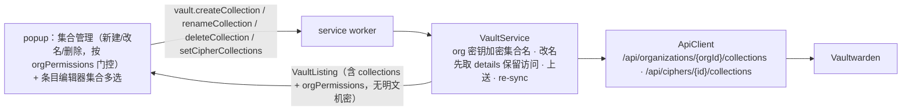

# 集合（Collection）CRUD + 条目集合归属编辑 设计

> 本 spec 已经一轮 5 维对抗性评审（含读 Vaultwarden Rust 源码）修订。评审逮到的**改名清空访问、Manager 类型死代码、必填 groups/users、orgPermissions 到不了 popup、缓存路径缺失**等 blocker 均已并入。

## 1. 目标

在已交付的「集合解密 + 分组过滤」之上补齐**集合写入路径**：

- **集合 CRUD**：在用户有管理权限的组织内**新建 / 改名 / 删除**集合。
- **条目集合归属编辑**：把组织条目分配到该组织内的集合（`PUT /api/ciphers/{id}/collections`）。

集合名用**组织密钥**（encType=2）加解密，全程在 worker 内；明文不过消息边界。集合 CRUD 仅对用户有管理权限的组织开放（解析 org 角色门控 UI）。

## 2. 范围

| 项目 | 处理方式 |
| --- | --- |
| 集合 CRUD | 新建 / 改名 / 删除，org-scoped 端点，集合名用 org 密钥加密。**改名保留现有 group/user 访问**（见 §3.3） |
| 权限门控 | 解析 sync profile 的 org 角色/状态/权限 → 纯函数 `canManageCollections`（fail-closed）；仅在可管理 org 显示 CRUD 控件；服务端为每次操作最终裁决方 |
| 条目归属编辑 | 仅组织条目；`PUT /api/ciphers/{id}/collections`；多选限该 org 内用户可见集合；worker 校验 collectionIds 同属该 org |
| 加密位置 | worker：集合名用对应 org 的 `SymmetricKey` 加/解密 |
| 同步 | 每次写操作成功后 `sync()` 刷新列表 |
| 不在范围 | 集合的群组/成员访问分配 UI（权限矩阵）、集合嵌套/树、集合级只读/隐藏密码权限编辑、无 org 密钥组织的操作、org 创建产品 UI（仅 LIVE 测试搭场景） |

## 3. 权限模型

当前 `OrganizationResponse` 仅 `{ id, key, name? }`，缺角色信息。扩展它并新增纯函数门控。

### 3.1 扩展 `OrganizationResponse`（`api/types.ts`）

```ts
export interface OrganizationResponse {
  id: string;
  key: string;
  name?: string | null;
  /** Org user type: 0 Owner, 1 Admin, 2 User, 3 Manager, 4 Custom.
   *  NOTE: Vaultwarden remaps Manager→Custom(4) before serialization (type_manager_as_custom),
   *  so type===3 essentially never appears on Vaultwarden; managers arrive as Custom(4) with
   *  the collection permission booleans set. §9.2 live-probe confirms. */
  type?: number | null;
  /** Membership status: 0 Invited, 1 Accepted, 2 Confirmed, -1 Revoked. */
  status?: number | null;
  /** Fine-grained permissions (Custom type / remapped Manager). Optional booleans. */
  permissions?: {
    createNewCollections?: boolean | null;
    editAnyCollection?: boolean | null;
    deleteAnyCollection?: boolean | null;
  } | null;
}
```

> 精确字段名/取值经 §9.2 live 探针核对 Vaultwarden 实际返回。

### 3.2 纯函数门控（`core/vault/org-permissions.ts`，新——**单一真源**）

```ts
export interface OrgPermission {
  id: string;
  name: string;           // org.name ?? '(unnamed organization)'
  canManageCollections: boolean;
}

/** UI gate: may this user create/rename/delete collections in this org? Server = final authority.
 *  FAIL-CLOSED: unknown/missing status or type → false. */
export function canManageCollections(org: OrganizationResponse): boolean;

/** Map a decryptable org to its permission summary (name fallback applied). */
export function toOrgPermission(org: OrganizationResponse): OrgPermission;
```

`canManageCollections` 规则（**fail-closed**）：

- `status !== 2`（含 undefined）→ `false`。
- `type` = Owner(0) / Admin(1) → `true`。
- `type` = Custom(4) → `permissions?.createNewCollections || permissions?.editAnyCollection || permissions?.deleteAnyCollection` 任一为真 → `true`，否则 `false`。（Vaultwarden 的 Manager 走此分支——它把 Manager 重映射为 Custom(4) 并按 access_all 设这些布尔。）
- `type` = Manager(3) → `true`（无害兜底；Vaultwarden 实际不会出现 type 3）。
- `type` = User(2) / undefined / 其它未知值 → `false`。

**计算位置（权威）**：纯映射在 `org-permissions.ts`；由 `VaultService.sync()` 对 `response.profile.organizations` **过滤为 orgKeys 中存在（可解密）的组织**后逐个 `toOrgPermission`，得 `OrgPermission[]`。**持久化**到新缓存键（§5.3），`listItems()` 读回——保证 popup 缓存加载路径也拿得到门控。

## 4. 架构



### 3.3 改名保留访问（关键——评审 blocker）

Vaultwarden 的 collection update handler **先删该集合所有 CollectionGroup/CollectionUser、再按请求 body 的 `groups`/`users` 重建**。因此 name-only PUT 会**清空所有人对该集合的访问**（数据损坏）。改名必须：

1. `GET /api/organizations/{orgId}/collections/{id}/details` 取现有 `groups`/`users`；
2. 连同新名 PUT 回去（`{ name: encName, groups: <preserved>, users: <preserved>, externalId }`）。

`create`/`update` 的 `groups`/`users` 数组**必填**（Vaultwarden serde 无 default，缺则 400）：create 传空数组（我们门控的用户具 access_all，创建后仍可见——§9.3 探针确认）。

## 5. 数据模型 / 接口

### 5.1 `ApiClient`（`core/api/client.ts`）

```ts
interface CollectionAccess { groups: unknown[]; users: unknown[] }  // opaque; preserved verbatim on rename

/** Create a collection. encName = encType=2 EncString under the ORG key. groups/users required (empty ok). */
createCollection(accessToken: string, orgId: string, encName: string): Promise<CollectionResponse>;
/** Fetch a collection's current group/user access, to preserve it across a rename (§3.3). */
getCollectionDetails(accessToken: string, orgId: string, id: string): Promise<CollectionAccess>;
/** Rename a collection, RESENDING preserved groups/users so access is not wiped. */
updateCollection(accessToken: string, orgId: string, id: string, encName: string, access: CollectionAccess): Promise<CollectionResponse>;
/** Delete a collection. Server updates member ciphers' membership (exact effect pinned by §9.6). */
deleteCollection(accessToken: string, orgId: string, id: string): Promise<void>;
/** Set a cipher's collection membership. Return ignored; re-sync is source of truth. */
updateCipherCollections(accessToken: string, id: string, collectionIds: string[]): Promise<void>;
```

- 端点：`POST /api/organizations/{orgId}/collections`、`GET/PUT/DELETE …/{id}[/details]`、`PUT /api/ciphers/{id}/collections`。**变体/权限（如非 owner 是否需 `…-admin`）经 §9 探针钉死。**
- 复用 `jsonRequest`（**必带 `'content-type': 'application/json'`**）/ `noBodyRequest`。

### 5.2 `VaultService`（`core/vault/vault-service.ts`）

```ts
createCollection(orgId: string, name: string): Promise<VaultListing>;
renameCollection(orgId: string, id: string, name: string): Promise<VaultListing>;
deleteCollection(orgId: string, id: string): Promise<VaultListing>;
setCipherCollections(id: string, collectionIds: string[]): Promise<VaultListing>;
```

- 通用前置：`requireUserKey()`（已解锁）→ `requireToken()`。CRUD 名用该 org 的 `SymmetricKey`（`buildOrgKeyMap`；缺失 → `AppError('error', 'Organization key unavailable')`）`encryptToText`。
- `renameCollection`：先 `getCollectionDetails` → 再 `updateCollection(..., access)`（§3.3）。
- `setCipherCollections`：校验该条目有 `organizationId`（个人条目 → `AppError('error','Only organization items can be assigned to collections')`）**且每个 collectionId 都属于该条目的 organizationId**（用缓存 `collections` 比对；跨 org/未知 id → `AppError('error','Invalid collection for this item')`）→ `PUT` → `sync()`。
- 每方法成功后 `sync()` 返回新 `VaultListing`。

### 5.3 `VaultListing` / 模型 / 缓存

- `VaultListing` 增 `orgPermissions: OrgPermission[]`。
- **新缓存键** `ORG_PERMISSIONS_CACHE_KEY`：`sync()` 计算并持久化（与 folders/collections 同法）；`listItems()` 读回并纳入返回；`clearCache()`/登出清除。
- `CollectionSummary` `{ id, name, organizationId }` 不变。`CipherSummary.collectionIds` **已存在且在全部三个 summary 分支（可解密/不可解密/错误）均填充**——编辑器预填无需改模型。

### 5.4 协议（`messaging/protocol.ts` + `background/router.ts` + popup 强转点）

```ts
// requests
| { type: 'vault.createCollection'; organizationId: string; name: string }
| { type: 'vault.renameCollection'; organizationId: string; id: string; name: string }
| { type: 'vault.deleteCollection'; organizationId: string; id: string }
| { type: 'vault.setCipherCollections'; id: string; collectionIds: string[] }
```

- **响应类型必须携带 orgPermissions**：现有 listing/CRUD 响应变体（`protocol.ts` 里 `{ items; folders; collections }`）**加 `orgPermissions: OrgPermission[]`**；四个新 op 复用同一（扩展后）形状。
- **popup 侧**：所有把响应 `as { items; folders; collections }` 强转的点（popup.ts 现有 4 处 + `applyListing`）**加 `orgPermissions`**，并存入模块态供门控——否则字段被强转丢弃、门控永远为空。
- router 加四个 case（沿用 folder case 的 `if (!deps.vault.X) throw` 守卫）。

## 6. 集合 CRUD 编排（worker）

镜像 folder CRUD，差异：org-scoped 端点、**org 密钥**加密名、**改名保留访问**（§3.3）。门控在 UI（popup 只对 `canManageCollections` 的 org 显示控件）；worker 不重复角色判断（保持薄），但 org 密钥缺失 fail-close 抛错，服务端错误透传。

## 7. 条目集合归属编辑

- `setCipherCollections`：worker 校验 org 条目 + collectionIds 同属该 org（§5.2）→ `PUT /api/ciphers/{id}/collections { collectionIds }` → `sync()`。
- 编辑器：仅 org 条目显示集合多选；候选 = `VaultListing.collections` 中 organizationId 匹配者（用户可见集合）；预填 = 条目当前 `collectionIds`。
- 与 `updateCipher` 独立：走专用端点，不混进 cipher 主体 PUT（规避组织条目编辑数据损坏风险）。

## 8. popup UI

- **集合管理入口**（现有集合下拉过滤旁）：仅当 `orgPermissions` 存在 `canManageCollections===true` 的 org 时显示。
  - 新建：org 选择器**源自 `orgPermissions.filter(canManageCollections)`**（**不是** `collections`——否则零集合的可管理 org 被漏掉），显示 `OrgPermission.name`；单个可管理 org 时自动选中、隐藏选择器；输入名 → `vault.createCollection`。
  - 改名 / 删除：对**现有集合**（限可管理 org 的集合，来自 `VaultListing.collections`）内联编辑器 + 二次确认，复用 folder 编辑器交互。
  - **两套谓词区分**：能否新建 = `orgPermissions`（与该 org 当前是否已有集合无关）；能改名/删除/作为归属目标 = `VaultListing.collections` 过滤该 org（可能为空）。
- **条目编辑器**：org 条目显示集合多选（复选框，候选为该 org 集合）；保存时若选择有变则 `vault.setCipherCollections`。
- CRUD 成功后**必须重渲染集合过滤条**（复用 `applyListing`/`renderCollectionFilter`），使删除/改名的选项不残留。删除集合无需额外缓存清理（`sync()` 覆盖集合缓存，且过滤器对失效选中自愈）。
- 文案英文。

## 9. 待 live 探针钉死的协议细节（planning 阶段先探再写计划）

> 先用一次性 `LIVE=1` 探针对真实 Vaultwarden（`10.0.1.20:8080`，2025.12.0）钉死，再写实现计划。**测试账户当前无组织**——探针需先建组织。

1. **org 创建（测试脚手架）**：`POST /api/organizations` 的 body。org 密钥须用**账户 RSA 公钥**（encType=4）包裹——代码库无处直接取账户公钥（`SyncProfile` 无 publicKey、无 `/api/accounts/keys` 方法）。**方案**：从会话中已解密的 PKCS8 私钥经 WebCrypto 导出 JWK、取 `{n,e}` 构造公钥 SPKI（仅测试脚手架，不动产品代码）。或加一个 `GET /api/accounts/keys` 客户端方法。钉死采用哪种。
2. **sync profile organization 字段**：`type` / `status` / `permissions` 确切名与取值；**确认 Vaultwarden 从不发 type 3（Manager 已重映射为 Custom 4）**（验证 §3.2）。
3. **集合创建 body**：`{ name, groups, users, externalId }` 中 groups/users 是否必填、是否可空；**创建者可见性**——门控用户具 access_all，空 users 时创建后 `/sync` 是否即含该集合。
4. **改名 wipe 语义**：验证 name-only PUT 是否清空 groups/users（§3.3）；`GET …/{id}/details` 的返回形状（groups/users 字段）；确认 resend 能保留访问。
5. **条目归属**：`PUT /api/ciphers/{id}/collections` 的 body（`{ collectionIds }`，camelCase）与返回；**确认非 owner/manager 用的正确端点变体**（`…/collections` vs `…-admin`）；参考现有 `shareCipher` 的 collectionIds body 作起点。
6. **删除影响**：删集合后其条目在 `/sync` 的 `collectionIds` 如何变；**验收标准：只属该集合的条目不被孤立/对 owner 隐藏**。

## 10. 错误处理

| 场景 | 表现 |
| --- | --- |
| org 密钥不可用（锁定/无权） | `AppError('error', 'Organization key unavailable')`；UI 提示 |
| 服务端拒绝（无权限/403 等） | 透传服务端 `error.message`（popup 沿用现有「直接展示原始服务端消息」的模式，不引入分类器） |
| 个人条目设集合 | `AppError('error', 'Only organization items can be assigned to collections')` |
| collectionId 跨 org / 未知 | `AppError('error', 'Invalid collection for this item')` |
| 删除/改名不存在的集合 | 服务端错误透传 |
| 无可管理 org | 不显示集合管理入口 |

## 11. 安全 / 边界

- 集合名在 worker 内用 org 密钥加/解密，明文不过边界；`VaultListing` 只带已解密集合名（可见分组信息，非机密）+ `OrgPermission`（角色布尔 + org 名）。
- 门控只**读取**角色、fail-closed、不放宽任何服务端校验；worker 对 org 密钥缺失 fail-close；`setCipherCollections` 加同 org 守卫（纵深防御，服务端仍为最终裁决）。
- 改名**保留**现有访问，避免清空组织成员对集合的访问（§3.3）。
- UserKey / org 密钥 / 私钥不出 worker；不引入新机密跨边界通道。
- 条目归属走专用端点，不触碰 cipher 主体加密路径。

## 12. 测试计划

- `org-permissions.test.ts`：`canManageCollections` 覆盖 Owner/Admin/Custom(各 permission 组合)/User/缺失 type/非 Confirmed 状态（fail-closed）；`toOrgPermission` 的 name 兜底。
- `vault-service.test.ts`（注入 fake api）：`createCollection`/`deleteCollection` 用 org 密钥加密名、调 api、re-sync；`renameCollection` **先 getCollectionDetails 再 update 且 resend 保留的 access**；org 密钥缺失抛错；`setCipherCollections` 个人条目抛错、跨 org collectionId 抛错、org 条目正常 PUT + re-sync；`sync()` 仅对有 org 密钥的组织填充 `orgPermissions` 并持久化、`listItems()` 读回。
- `router.test.ts` / protocol：四个新分支；响应含 orgPermissions。
- `LIVE=1`（`test/live/collections.live.test.ts`）：建 org（§9.1 SPKI 方案）→ 建集合 → 改名（验证访问保留）→ 建 org 条目 → 设集合归属 → sync 验证 → 删集合 → sync 验证。
- popup：`npm run typecheck` + `npm run build` + 人工冒烟。

## 13. 非目标

- 集合的群组/成员访问**分配** UI（仅在改名时**保留**现有分配，不提供编辑）。
- 集合嵌套 / 树形展示。
- 集合级只读/隐藏密码权限编辑。
- 组织创建产品 UI（仅 LIVE 测试用）。
- 无 org 密钥组织的集合操作。
- i18n。
