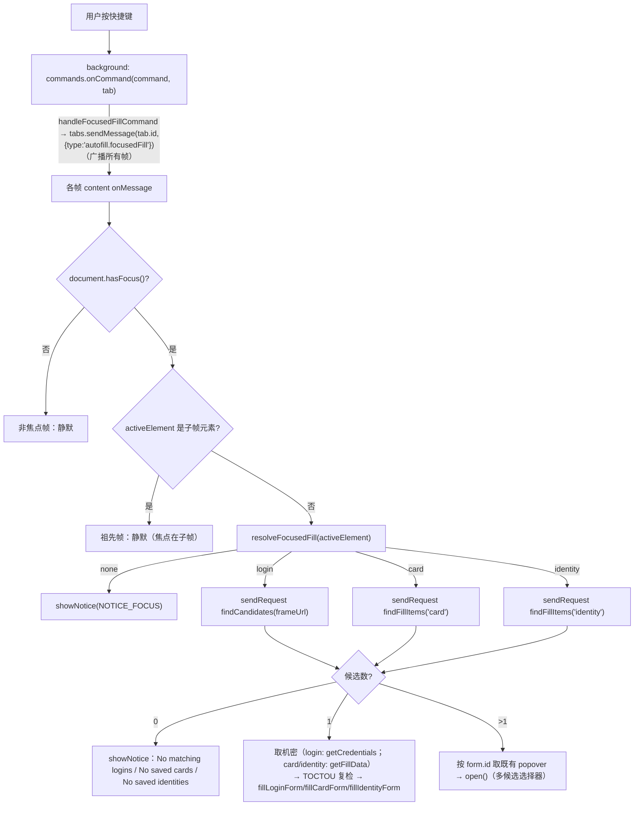

# 焦点字段自动填充键盘快捷键设计（Focused-fill keyboard shortcut）

> 本 spec 已经一轮 5 维对抗性评审（代码库事实核验 / 安全不变量 / 一致性歧义 / 完整性范围 / 边界架构）修订。评审发现的帧路由、信任模型、Shadow DOM、CVC 消歧、popover 复用、TOCTOU、0 候选、可测性等问题均已并入。

## 1. 目标

给已交付的登录 / Card / Identity 自动填充加一个**键盘快捷键**：用户把光标放进一个**已识别的登录/卡/身份字段**后按快捷键，扩展按该字段所属**表单类型**把对应条目填进去——无需悬停点盾牌图标、也无需右键菜单。

**一个统一命令**覆盖三类表单：由持有焦点的帧读 `document.activeElement`、判定其所属表单类型后分派到既有填充路径。

## 2. 范围

| 项目 | 处理方式 |
| --- | --- |
| 命令数量 | **单个** manifest `command`（`autofill-focused`），按焦点表单类型自动分派 login/card/identity |
| 触发位置 | `chrome.commands.onCommand`（浏览器级，网页无法伪造）→ 后台广播给活动标签页各帧 → 持焦点帧处理 |
| 焦点要求 | 焦点必须在一个**被识别为登录/卡/身份字段**的元素上（`resolveFocusedFill != 'none'`）；否则提示，不做页面级回退 |
| 单条命中 | 直接填入（复用现有 worker 请求 + 填充函数，含 TOCTOU 复检） |
| 多条命中 | 在焦点字段所属表单处**编程式打开既有 popover 选择器**，用户再选 |
| 复用 | 完全复用现有 worker 请求（URL 匹配、reprompt 门、SSN/护照/驾照剔除）——**不新增 worker/router 请求类型** |
| 默认键位 | `Ctrl+Shift+F`（mac `Command+Shift+F`），可在 `chrome://extensions/shortcuts` 改；冲突时 Chrome 静默丢弃默认键 |
| 不在范围 | 自定义键位 UI、填充后自动跳字段、多命令、无焦点页面级回退、Shadow DOM / contenteditable 字段、login 之外的 URL 匹配放宽 |

## 3. 核心约束、信任模型与帧路由

### 3.1 后台看不到 DOM → 委托 content

`chrome.commands.onCommand` 在 **service worker（后台）** 触发，回调 `(command, tab)`——**后台看不到页面 DOM、不知道焦点在哪**。因此填充判定必须委托给 content script。后台是**薄转发**：收到命令 → `tabs.sendMessage(tab.id, { type:'autofill.focusedFill' })`（不带 `frameId`，广播到标签页所有帧）。

### 3.2 帧路由（评审修正——原「仅焦点 iframe hasFocus() 为真」的说法是错的）

`document.hasFocus()` 对**焦点所在文档及其所有祖先文档**都返回 `true`（WHATWG「has focus steps」）。所以焦点在子 iframe 内时，**父帧/顶层帧的 `hasFocus()` 也为真**。真正区分「持有焦点的叶子帧」与「祖先帧」的是 `document.activeElement`：

- **叶子帧**（真正拥有焦点的输入所在帧）：`activeElement` 是那个真实字段。
- **祖先帧**：`activeElement` 是承载子上下文的 `<iframe>`/`<frame>` 元素，不是可填字段。

因此判定规则（`handleFocusedFill` 开头）：

```
if (!document.hasFocus()) return;                       // 本标签页非活动 / 本帧无焦点：静默
const el = document.activeElement;
if (el instanceof HTMLIFrameElement || el instanceof HTMLFrameElement) return; // 祖先帧：焦点在子帧，静默、不弹提示
const target = resolveFocusedFill(el);
if (target.kind === 'none') { showNotice(NOTICE_FOCUS); return; }  // 本帧确有焦点但落在未识别字段
… 按 kind 分派
```

关键：`'none'` 的提示**只在本帧确实持有焦点、且 activeElement 不是子帧容器**时才弹，避免祖先帧误弹提示。

### 3.3 信任模型（评审 blocker——必须显式化）

单条命中是**直接填充**，没有 DOM `event.isTrusted` 门。这**不是**回归，与已交付的**右键菜单填充**（M2）是**同一信任模型**：

- content script 的 `browser.runtime.onMessage` 只接收来自**扩展上下文**（后台）的消息。网页脚本无法向它投递——页面的 `window.postMessage` 只到 `window` 的 message 事件，`chrome.runtime.sendMessage` 对本扩展不可用（未设 `externally_connectable`）。**因此网页无法伪造 `autofill.focusedFill`。**
- 后台只在真实 `chrome.commands.onCommand`（浏览器分发、页面不可合成）时才发该消息。
- 既有右键菜单填充（`context-menu.ts` → `tabs.sendMessage(FillCommand)` → `handleContentCommand` 直接填）同样在 content 填充点无 isTrusted 门——信任来自「浏览器分发事件 + 扩展消息通道」这条独立可信路径。快捷键复用完全相同的边界。
- 悬停 popover 路径的 `event.isTrusted` 门（`popover.ts` 盾牌点击、候选选择）**保持不变**；新增的 `open()` 仅从本可信消息处理器调用（见 §6）。

**不变量**：Card/Identity 与登录机密的释放，其可信性来自「浏览器级命令事件 → 扩展消息通道」，与右键菜单同级；worker 侧 reprompt 门、URL 匹配、国民 ID allowlist 剔除**全部保持**，快捷键不放宽任何判定，也不新增机密跨边界通道（命令消息 `{type:'autofill.focusedFill'}` 不含 vault 数据）。

## 4. 数据流



注：登录单条路径是**两步**——先 `findCandidates`（仅计数与匹配，返回不含机密的候选）→ 命中恰 1 条再 `getCredentials`（取密码/TOTP）。卡/身份同理：`findFillItems` 列条目 → 1 条再 `getFillData`。

## 5. 新增模块

### 5.1 共享排除逻辑（评审 important——exclude 集原是 `attachPopovers` 内的局部 const，不可复用）

把 `attachPopovers`（`autofill.ts:93-109`）里构造登录表单与 exclude 集的逻辑抽成**单一真源**，供 `attachPopovers` 与 `resolveFocusedFill` 共用：

```ts
// autofill.ts 导出（或置于 focused-fill.ts 供两处 import）
export interface FillExclusion {
  loginForms: DetectedLoginForm[];   // 已剔除「CVC-as-password 冒充登录」的真实登录表单
  exclude: Set<Element>;             // 上述登录表单的 username/password/totp 字段
}
export function computeFillExclusion(root: ParentNode = document): FillExclusion {
  const cardCodeFields = new Set<Element>();
  for (const card of detectCardForms(root)) {
    const code = card.fields.get('code');
    if (code) cardCodeFields.add(code);
  }
  const loginForms: DetectedLoginForm[] = [];
  const exclude = new Set<Element>();
  for (const form of detectLoginForms(root)) {
    if (form.passwordInput && cardCodeFields.has(form.passwordInput)) continue; // CVC，不是登录
    loginForms.push(form);
    for (const el of [form.usernameInput, form.passwordInput, form.totpInput]) if (el) exclude.add(el);
  }
  return { loginForms, exclude };
}
```

`attachPopovers` 改为调用 `computeFillExclusion` 得到 `loginForms`/`exclude`，再 `detectCardForms(root, exclude)` / `detectIdentityForms(root, exclude)`——行为与现状**逐字等价**，只是去重。

> 注：`detectLoginForms`/`detectCardForms`/`detectIdentityForms` 均已带可选 `root: ParentNode = document` 参数，可直接注入测试根，无需改签名。

### 5.2 `src/content/focused-fill.ts`（纯函数、可单测）

```ts
export type FocusedTarget =
  | { kind: 'login'; form: DetectedLoginForm }
  | { kind: 'card'; form: DetectedFillForm }
  | { kind: 'identity'; form: DetectedFillForm }
  | { kind: 'none' };

/**
 * 判定焦点字段所属的可填表单。次序（与 attachPopovers 一致）：
 *   1) computeFillExclusion(root) → { loginForms, exclude }（已含 CVC-as-password 剔除）
 *   2) activeEl 是某 loginForms 的 username/password/totp 字段 → 'login'
 *   3) activeEl 是某 detectCardForms(root, exclude) 的字段 value → 'card'
 *   4) activeEl 是某 detectIdentityForms(root, exclude) 的字段 value → 'identity'
 *   5) 否则 → 'none'
 * activeEl 非 HTMLInputElement/HTMLSelectElement（如 body、div、contenteditable）→ 直接 'none'。
 */
export function resolveFocusedFill(activeEl: Element | null, root: ParentNode = document): FocusedTarget;
```

**CVC-as-password 正确性**：CVC 字段是被跳过的登录表单的 `passwordInput`（不在 `loginForms`、其字段未入 `exclude`），同时是卡 `code` 字段 → 步骤 3 的 `detectCardForms` 命中 → `'card'`。与 §9 测试一致。**先做 CVC 剔除、再判登录** 是关键次序。

## 6. 改造

| 文件 | 改动 |
| --- | --- |
| `src/manifest.json` | 顶层加 `commands.autofill-focused`（`suggested_key.default="Ctrl+Shift+F"`、`.mac="Command+Shift+F"`、`description`）。commands **无需** `permissions` 条目。 |
| `src/manifest.test.ts` | 断言 `commands['autofill-focused']` 存在、含 `description` 与 `suggested_key.default`。 |
| `src/background/commands.ts`（**新**，可测） | `handleFocusedFillCommand(command, tab, deps)`：`command === 'autofill-focused'` 且 `typeof tab?.id === 'number'` 时 `deps.tabs.sendMessage(tab.id, { type:'autofill.focusedFill' })`；否则 no-op。镜像 `context-menu.ts` 的可注入依赖风格。 |
| `src/background/commands.test.ts`（**新**） | 命令名匹配 + 有效 tab.id → sendMessage 被调；命令名不符 / 无 tab.id → 不调。 |
| `src/background/index.ts` | `browser.commands.onCommand.addListener((command, tab) => void handleFocusedFillCommand(command, tab, { tabs:{ sendMessage:(id,m)=>browser.tabs.sendMessage(id,m) } }))`。薄。 |
| `src/messaging/protocol.ts` | `ContentCommand` 联合加 `FocusedFillCommand = { type:'autofill.focusedFill' }`。 |
| `src/content/autofill.ts` | 抽 `computeFillExclusion`（§5.1）、`attachPopovers` 改用之；新增 module-level `popoverRegistry: Map<string, AutofillPopover>`，`attachPopover`/`attachFillPopover` 里 `popoverRegistry.set(form.id, popover)`；`onMessage`/`isContentCommand` 识别 `autofill.focusedFill`；新增 `handleFocusedFill()`（§7）。 |
| `src/content/popover.ts` | `AutofillPopover` 接口加 `open(): void`——直接调用 `options.onOpen()`（现状里盾牌点击处理器在 `event.isTrusted` 通过后也只是调 `options.onOpen()`；`open()` 走同一入口、**不派发合成 click**，故不受 isTrusted 门影响）。盾牌点击处理器的 `if(!event.isTrusted) return` 保持不变。 |
| `src/content/focused-fill.ts` | 新建（§5.2）。 |

**dataset 归属更正**：`popover.element.dataset.vwPopoverFor = form.id` 实际写在 `attachPopover`/`attachFillPopover`（`autofill.ts:128,138`），非 `attachPopovers`。注册表写入与之同处。

## 7. 填充分派（`handleFocusedFill`，content）

```text
handleFocusedFill():
  if !document.hasFocus(): return
  el = document.activeElement
  if el is <iframe>/<frame> element: return           # 祖先帧，焦点在子帧
  target = resolveFocusedFill(el)
  if target.kind == 'none': showNotice(NOTICE_FOCUS); return

  if target.kind == 'login':
    cands = await sendRequest(findCandidates, frameUrl)      # 不含机密
    if err: notice(messageForError); return
    if cands.length == 0: notice('No matching logins'); return
    if cands.length > 1: openPickerFor(target.form.id, 'login'); return
    creds = await sendRequest(getCredentials, cands[0].id, frameUrl)   # reprompt 抛→notice
    if err(reprompt): showNotice(NOTICE_REPROMPT); return
    if err: notice(messageForError); return
    # TOCTOU 复检（复用 fillSelected 的守卫）：字段仍 isConnected 且 frameUrl 未变
    if login 字段失联 or frameUrl 变: showNotice('Page changed before autofill'); return
    fillLoginForm(target.form, creds)

  else (card | identity):
    items = await sendRequest(findFillItems, kind)
    if err: notice(messageForError); return
    if items.length == 0: notice(kind=='card' ? 'No saved cards' : 'No saved identities'); return
    if items.length > 1: openPickerFor(target.form.id, kind); return
    data = await sendRequest(getFillData, items[0].id, kind)   # reprompt 抛→notice；SSN/护照/驾照已剔除
    if err(reprompt): showNotice(NOTICE_REPROMPT); return
    if err: notice(messageForError); return
    # TOCTOU 复检（评审 important——现 card/identity 填充无此守卫）：
    if target.form 任一 field 失联: showNotice('Page changed before autofill'); return
    kind=='card' ? fillCardForm(target.form, data) : fillIdentityForm(target.form, data)
```

### 7.1 多候选打开选择器（`openPickerFor(formId, kind)`）

```text
openPickerFor(formId):
  pop = popoverRegistry.get(formId)
  if pop and pop.element.isConnected:
     pop.open(); return
  # 陈旧/未命中（SPA 刚重渲染、attachPopovers 尚未跑）：同步补挂后重取一次
  popoverRegistry.delete(formId)          # 清陈旧项
  attachPopovers(getFrameUrl)             # 幂等（attachIfNew 去重），为当前表单补挂 popover
  pop = popoverRegistry.get(formId)
  if pop and pop.element.isConnected: pop.open()
  else showNotice('Multiple matches — click the field’s Vaultwarden icon to choose')
```

- `resolveFocusedFill` 从 DOM 现读 `form.id`（来自字段 dataset `vwAutofillId`/`vwFillId`），故正常情况下 id 与最近一次 `attachPopovers` 登记的一致 → 直接命中。
- 陈旧项（旧 form.id → 已 `.remove()` 的 popover）只在极端时序出现，靠 `isConnected` 检测 + 补挂重取兜住；补挂仍失败才提示手动点图标。

### 7.2 "1 条" 语义（评审 important——需显式）

- **登录**：`findCandidates` 已在 worker 内做 **URL 匹配**，`length==1` = 当前站点恰有一条匹配登录 → 直填。
- **卡 / 身份**：`findFillItems` **列全部**卡/身份（**无 URL 匹配**，与现有弹层/右键一致），`length==1` = **整个 vault 只有一张卡 / 一个身份** → 直填；多于一张即开选择器。这是有意行为：卡/身份无站点关联可用于筛选。

## 8. 文案与错误处理（全英文，评审 minor——统一）

常量集中定义：

| 常量 | 文案 | 触发 |
| --- | --- | --- |
| `NOTICE_FOCUS` | `Focus a login, card, or identity field, then use the shortcut` | 本帧有焦点但 activeElement 未被识别为可填表单字段（`'none'`） |
| `NOTICE_REPROMPT` | `Protected item — open the extension to verify` | 单条命中但条目 reprompt，worker 抛 `reprompt_required`（复用现有文案） |
| — | `No matching logins` | 登录 URL 无匹配（复用现有 `no_match`） |
| — | `No saved cards` / `No saved identities` | 卡/身份 vault 为空 |
| — | `Page changed before autofill` | TOCTOU：取机密后字段失联 / frameUrl 变（复用现有登录路径文案） |
| — | `Multiple matches — click the field’s Vaultwarden icon to choose` | 多候选但 popover 注册表补挂后仍未命中 |
| — | `Vault is locked` / `Sync required` 等 | 复用现有 `messageForError` |

多候选选择器里 reprompt 条目：沿用现有 popover 行为——选中时 worker 拒绝释放并回状态；**本 spec 不新增 popover 内每条目 🔒 徽标**（现有 `showCandidates` 未渲染 reprompt 徽标，避免扩大改动）。

## 9. 测试计划

- `src/content/focused-fill.test.ts`（happy-dom）：
  - 焦点在登录 username / password / totp → `{kind:'login'}`；焦点在卡号字段 → `{kind:'card'}`；焦点在身份地址字段 → `{kind:'identity'}`；焦点在普通非表单 input / body / contenteditable div → `{kind:'none'}`。
  - **CVC-as-password**：焦点在同时被登录检测视为 password、被卡检测视为 `code` 的字段 → `{kind:'card'}`（不误判为 login）。
- `src/content/autofill.test.ts`（`handleFocusedFill` 分派，注入 fake `sendRequest` + fake popover 注册表）：
  - `document.hasFocus()` 为 false → 不发请求（happy-dom 的 `hasFocus()` 默认真，需 `vi.spyOn(document,'hasFocus').mockReturnValue(false)`；同理测祖先帧用 `activeElement` 为 iframe 元素）；
  - 登录单条 → 调 `getCredentials` + `fillLoginForm`；登录多条 → 调 `openPickerFor`（对应 popover.open()）；登录 0 → notice；
  - 卡单条 → `getFillData`+`fillCardForm`；卡多条 → open()；卡 0 → 'No saved cards'；身份同理；
  - reprompt 抛错 → `NOTICE_REPROMPT`；TOCTOU（fill 前置字段 `remove()`）→ 'Page changed before autofill'。
- `src/content/popover.test.ts`：`open()` 触发 `onOpen` 并展开候选区；确认 `open()` 不经 isTrusted 门（直接调用有效），而合成 click 仍被 isTrusted 拒。
- `src/background/commands.test.ts`：命令名匹配 + 有效 tab.id → `sendMessage(tabId,{type:'autofill.focusedFill'})`；命令名不符 / 无 tab.id → 不调。
- `src/manifest.test.ts`：`commands['autofill-focused']` 断言（含 `description`、`suggested_key.default`）。
- `npm run typecheck` + `npm run build` + 人工冒烟：登录页、结账卡表单、地址身份表单各按一次快捷键（单条直填 / 多条弹选择器 / iframe 内字段 / 无识别字段提示）。

## 10. 安全 / 边界

- 只新增一个后台→content 命令 `{type:'autofill.focusedFill'}`，**不含 vault 数据**。
- 释放机密的可信性来自「浏览器级命令事件 + 扩展消息通道」，与已交付右键菜单同级；worker reprompt 门 / URL 匹配 / 国民 ID allowlist 剔除全部保持（§3.3）。
- 帧路由：仅持焦点且 activeElement 为已识别字段的叶子帧动作；祖先帧（activeElement 为子帧元素）与非焦点帧静默、不弹提示（§3.2）。
- 焦点必须落在已识别的登录/卡/身份字段——不做页面级「猜表单」回退，避免把机密填进未预期表单。
- **已知边界（与现有 autofill 相同限制，记为超范围）**：
  - **Shadow DOM**：`document.activeElement` 对 shadow 内焦点返回 host（closed shadow 更不可达），现有检测器 `querySelectorAll` 不穿透 shadow 边界 → shadow 内表单字段解析为 `'none'`（弹 `NOTICE_FOCUS`）。与现有悬停 popover 一致。
  - **跨源 iframe**：命令广播到各帧，跨源子帧各自的 content 实例独立处理其自身焦点；父帧无法读子帧字段。
  - **contenteditable**：非 input/select，`isFillableField` 不接受 → `'none'`。
  - **孤立可填字段**（如仅一个搜索框、无提交件的孤立用户名框）不构成登录/卡/身份表单 → `'none'`，弹 `NOTICE_FOCUS`（文案已措辞为「聚焦一个 登录/卡/身份 字段」，避免误解为"未聚焦"）。

## 11. 非目标

- 自定义键位设置 UI（用 Chrome 原生 `chrome://extensions/shortcuts`）。
- 填充后自动聚焦/跳到下一字段、连续填充。
- 每类型一个独立命令。
- 无焦点时的页面级表单猜测与填充。
- Shadow DOM / contenteditable 字段支持（与现有 autofill 同限制）。
- popover 内每条目 reprompt 🔒 徽标（保持现有渲染）。
- 打开扩展弹窗 / 锁定 / 生成密码等其它命令（本特性只做「填充焦点字段」一个命令）。
- i18n（`showNotice` 文案英文，与现有一致）。
